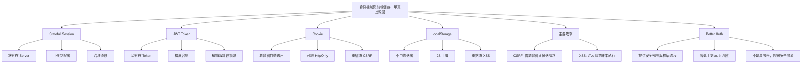
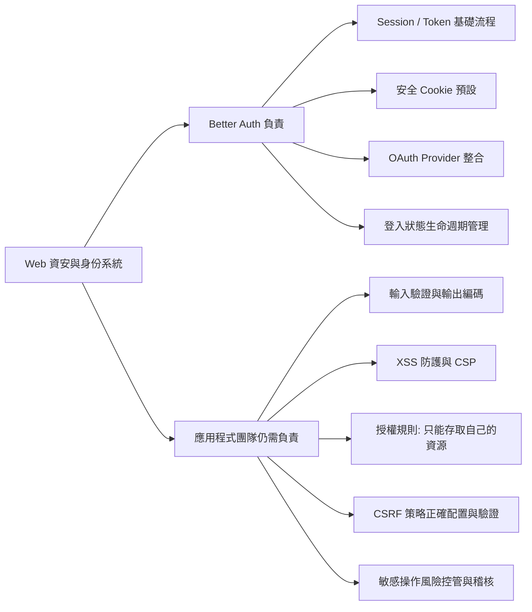

# Session 與 Token 機制、現況弱點、與 Better Auth 導入講義

## 使用情境

- 對象：已完成目前 demo 專案登入與訂單流程的學生
- 目標：
  - 理解「為什麼需要 session」
  - 看懂目前專案的身份機制與弱點
  - 能比較兩種典型作法（Stateful Session vs JWT Token）
  - 理解導入 Better Auth 省下哪些工程成本與風險

---

## 一、先建立核心觀念：為什麼需要 Session

### 1. HTTP 的本質是無狀態

- 每次請求彼此獨立
- Server 單看某一個請求，不會自然知道「你是不是剛剛登入的同一個人」

### 2. Session 的本質

- Session 是一種「跨請求識別使用者身份」的機制
- 目的不是只有登入成功，而是：
  - 在後續每支 API 請求都能辨認「你是誰」
  - 執行授權（你能不能做這件事）
  - 管理登入狀態生命週期（過期、登出、撤銷）

### 3. 常見混淆

- 「登入」不是 session；登入只是一個入口
- 「有 userId」不是安全身份；userId 只是資料欄位
- 「前端說自己是誰」不代表可信，必須由後端驗證

---

## 二、目前專案機制（教學簡化版）

### 0. 補充：SessionUser 在 contracts.ts 中的角色

`shared/contracts.ts` 扮演 single source of truth，同時服務後端路由、前端型別與 API contract 設計。其中 `SessionUser` 的語意特別值得說明。

**它代表什麼**

「登入成功後，系統對使用者身份的最小可信描述」。不是完整的 User 資料庫記錄，而是安全對外揭露的使用者快照：

```
User（DB 記錄）      SessionUser（對外揭露）
id        ──────►  id
email     ──────►  email
name      ──────►  name
password  ✗（過濾掉，永不對外）
```

**它與 `User` 的區別**

|            | `User`               | `SessionUser`                   |
| ---------- | -------------------- | ------------------------------- |
| 代表       | 資料層的使用者實體   | 身份驗證後的可信快照            |
| 可能含     | password（後端內部） | 絕對不含 password               |
| 使用位置   | Store / DB 操作      | Auth 介面、API 回傳、前端識別   |
| 未來可擴充 | 新增 DB 欄位         | 新增 `role`、`exp`、provider 等 |

**設計哲學**

- single source of truth 不只是「資料形狀對齊」，還帶有「**安全揭露邊界**」的語意
- `Auth.ts` 的 `login()` 與 `getUserById()` 的回傳型別都是 `SessionUser`，後端路由因此保證不洩漏 password
- 未來若要加 `role`、token exp、provider，從 `SessionUser` 擴充，不動 `User`

---

### 1. 現況流程

1. 前端送出 email/password 到 `/api/auth/login`
2. 後端驗證成功後回傳 `SessionUser`（id/email/name）
3. 前端把使用者資訊存進 `localStorage`
4. 後續 API 呼叫帶 `userId`（query string）
5. 後端依 `userId` 查詢資料

### 2. 這個作法的教學價值

- 可以快速讓學生完成「登入 -> 操作資料 -> 顯示結果」
- 容易理解資料流向
- 很適合初學階段的功能串接

### 3. 這個作法的弱點（必講）

1. 可偽造：前端可改 localStorage 或改 URL 的 userId
2. 可越權：若後端只信任 userId，可能讀到別人的資料
3. 難撤銷：無統一的 session/token 失效治理
4. XSS 風險擴大：localStorage 裡的身份資料較容易被惡意腳本讀取
5. 缺稽核：難完整追蹤裝置、登入來源與異常行為

### 4. 補充重點：Cookie 與 localStorage 有何不同

這兩者常被混在一起講，但它們的安全邊界完全不同。最重要先記住兩句話：

- Cookie 會由瀏覽器在符合條件時「自動隨請求送出」
- localStorage 不會自動送出，必須由前端程式手動讀取再附加

#### 核心差異比較

| 面向      | Cookie                       | localStorage                 |
| --------- | ---------------------------- | ---------------------------- |
| 傳送方式  | 瀏覽器自動附加到 HTTP 請求   | 不會自動傳，前端手動附加     |
| JS 可讀性 | 可設 `HttpOnly` 讓 JS 讀不到 | JS 一定可讀                  |
| 主要風險  | CSRF（因為會自動送）         | XSS 竊取憑證（因為 JS 可讀） |
| 容量      | 通常每個約 4KB               | 通常較大（常見約 5MB）       |
| 常見用途  | session id、登入憑證         | UI 偏好、非敏感快取          |

#### 安全面向要講清楚

1. 為什麼 Cookie 常搭配 `HttpOnly`

- 若憑證放在 HttpOnly Cookie，惡意 JS 無法直接讀取，能降低 XSS 竊取憑證風險
- 但 Cookie 會自動送出，所以要搭配 `SameSite` 與 CSRF 防護策略

2. 為什麼 localStorage 對憑證較危險

- 只要前端可執行惡意腳本（XSS），腳本就可能讀到 localStorage 裡的 token
- 一旦 token 被帶走，攻擊者可在外部重放請求

3. 常見誤解

- 誤解 A：「localStorage 不會自動送，所以比較安全」
- 更正：它只是在 CSRF 面向較少自動送出問題，但在 XSS 面向通常更脆弱
- 誤解 B：「Cookie 一定不安全」
- 更正：若正確設定 `HttpOnly + Secure + SameSite`，Cookie 反而是目前常見且成熟的登入憑證載體

#### 教學實務建議

- 登入憑證（session id / token）優先考慮放在安全 Cookie（特別是 HttpOnly）
- localStorage 主要放非敏感資料（例如主題設定、UI 狀態）
- 若實務上必須使用 token，也應設計短效 access token、續期策略與撤銷機制

### 5. 補充基礎資安名詞：CSRF 與 XSS

這兩個名詞常一起出現，但攻擊路徑不同。教學上要先分清楚：

- CSRF 是「借你的瀏覽器身份去送請求」
- XSS 是「在你的網頁上下文中執行惡意腳本」

#### CSRF 是什麼

CSRF（Cross-Site Request Forgery，跨站請求偽造）是指：
攻擊者誘導已登入使用者訪問惡意頁面，讓瀏覽器自動帶著既有 Cookie 對目標站發送請求，造成未授權操作。

典型場景：

1. 使用者已登入銀行網站（瀏覽器有 session cookie）
2. 使用者打開惡意網站
3. 惡意網站觸發一個轉帳請求到銀行網站
4. 瀏覽器自動夾帶 cookie，若後端沒防護就可能誤判為合法操作

防護重點：

1. 使用 `SameSite` Cookie 策略
2. 對敏感操作加入 CSRF token 驗證
3. 檢查 `Origin` / `Referer`
4. 高風險操作加二次驗證（密碼、OTP）

#### XSS 是什麼

XSS（Cross-Site Scripting，跨站腳本）是指：
攻擊者把惡意 JavaScript 注入到頁面中，並在受害者瀏覽器執行。

典型風險：

1. 讀取 localStorage / sessionStorage 裡的憑證
2. 偷取使用者資料
3. 冒用使用者發送 API 請求
4. 竄改畫面或釣魚

防護重點：

1. 所有輸入做驗證與輸出編碼（避免直接插入 HTML）
2. 避免不安全 DOM API（如直接拼接 `innerHTML`）
3. 導入 CSP（Content Security Policy）
4. 憑證優先使用 HttpOnly Cookie，降低被 JS 直接讀取機率

#### 把兩者對照給學生看

| 面向       | CSRF                  | XSS                          |
| ---------- | --------------------- | ---------------------------- |
| 攻擊核心   | 偽造請求來源          | 注入並執行惡意腳本           |
| 主要利用點 | 瀏覽器自動帶 Cookie   | 前端可執行腳本能力           |
| 常見受害   | 未授權狀態變更        | 憑證外洩、資料外洩、帳號冒用 |
| 防護關鍵   | SameSite + CSRF token | 輸入/輸出安全 + CSP          |

一句話教學總結：

- CSRF 重點是「請求是不是你本人真的要送的」
- XSS 重點是「頁面是不是被注入不該執行的程式碼」

---

## 三、典型做法 A：Stateful Session（伺服器端 Session）

### 1. 機制

1. 登入成功後，Server 建立一筆 session 記錄（DB/Redis）
2. 回給前端一個 session id（通常放在 Cookie）
3. 每次請求帶 session id
4. Server 用 session id 查 session store，拿到 user 身份與狀態

### 2. 優點

1. 可立即失效（強制登出、封鎖帳號）
2. 權限異動可即時生效
3. 伺服器可集中控管 session 安全策略
4. 審計與追蹤通常更直觀

### 3. 缺點

1. 需要 session store（額外基礎設施）
2. 分散式部署需要共享狀態
3. 維運與容量規劃成本較高

### 4. 適合情境

- 企業內部系統
- 強控管、強稽核場景
- 需要快速撤銷存取權限的系統

---

## 四、典型做法 B：Token（常見 JWT，偏 Stateless）

### 1. 機制

1. 登入成功後，Server 簽發 token（access token）
2. 前端於後續請求帶 token（常見 `Authorization: Bearer ...`）
3. Server 驗簽 token，取出 user 身份

### 2. 優點

1. 擴展性佳，適合 API 化與微服務化
2. 不一定每次查 session store
3. 跨服務傳遞身份資訊方便

### 3. 缺點

1. 撤銷較難（需要 blacklist 或短效 token + refresh token）
2. token 生命週期與輪替策略較複雜
3. 若存放或傳輸設計不當，安全風險高

### 4. 適合情境

- 多服務架構
- 高擴展需求
- 對 API gateway / BFF 架構友善

---

## 五、Stateful Session vs JWT：教學比較表

| 面向         | Stateful Session             | JWT Token                |
| ------------ | ---------------------------- | ------------------------ |
| 狀態位置     | Server 保存 session          | 多為 client 持有 token   |
| 水平擴展     | 需共享 session store         | 較容易                   |
| 強制登出     | 容易                         | 相對困難（需額外機制）   |
| 權限即時變更 | 容易                         | 受 token 壽命影響        |
| 實作複雜度   | 中（偏基礎設施）             | 中高（偏安全策略）       |
| 常見風險     | session 固定攻擊、store 管理 | token 外洩、撤銷策略不足 |

教學結論：

- 兩者沒有絕對誰最好，重點在需求、風險模型與團隊能力
- 「可治理性」與「可擴展性」常是核心取捨

---

## 六、導入 Better Auth：它取代了什麼、簡化了什麼

### 1. Better Auth 代替的工作

1. session/token 的標準流程管理
2. cookie 與常見安全預設
3. OAuth provider 整合（如 Google）
4. account/session/user 關聯模型的實作細節
5. 常見 auth 邊界情境（過期、續期、登出）

### 2. Better Auth 簡化的工程成本

1. 減少手刻安全機制的漏洞風險
2. 減少重複開發（登入、登出、維持登入）
3. 讓團隊把精力放在業務邏輯與授權規則
4. 更容易對齊業界實務

### 3. Better Auth 的好處（對教學與實務）

1. 把容易做錯的安全細節標準化
2. 降低功能上線時間
3. 讓學生理解「框架不是魔法，而是封裝最佳實務」
4. 後續與資料庫、部署、第三方登入整合更順

---

## 七、建議授課節奏（20-30 分鐘）

### 0-5 分鐘：問題意識

- 問學生：如果我把網址 `userId=0001` 改成 `0002`，會發生什麼？
- 引導出「身份不能只靠前端宣稱」

### 5-12 分鐘：兩種典型機制

- 分別講 Stateful 與 JWT
- 用同一個請求流程對比差異

### 12-20 分鐘：回到專案現況

- 指出目前方案的價值與限制
- 說明為何此刻不先手刻 JWT，而是往 Better Auth 遷移

### 20-30 分鐘：導入策略

- 先導入 Better Auth（最小可行）
- 再補授權規則、錯誤處理、觀測與稽核

---

## 八、課堂提問（可直接使用）

1. 為什麼「前端傳 userId」不等於「已驗證身份」？
2. 若你要支援強制登出，Stateful 跟 JWT 會怎麼做？
3. 如果產品是單體後台系統，你會先選哪個機制？為什麼？
4. 如果產品走多服務、跨網域 API，你會調整什麼策略？
5. Better Auth 幫你節省了哪些「看不到但關鍵」的安全工作？

---

## 九、總結

- Session 的核心：在每次請求可信地辨識與治理身份
- 現況 demo：有教學價值，但不等於生產級安全
- 兩種典型機制：是取捨，不是二選一神話
- Better Auth：把標準機制產品化，降低風險並加速交付

> 教學定位建議：
> 先讓學生「看見風險」，再讓學生「理解取捨」，最後導入 Better Auth「理解工程化的價值」。

---

## 十、單頁比較圖（可直接貼投影片）



### 讀圖講法（1 分鐘版）

1. 先分機制：Stateful 偏治理、JWT 偏擴展
2. 再分憑證載體：Cookie 主要面對 CSRF，localStorage 主要面對 XSS
3. 最後帶到 Better Auth：它幫你把正確預設做好，但不能取代輸入驗證、輸出編碼與授權檢查

---

## 十一、Better Auth 責任邊界圖（它做什麼、你還要做什麼）



### 對照表（教學可直接念）

| 題目           | Better Auth 能幫到                      | 你仍需實作                                  |
| -------------- | --------------------------------------- | ------------------------------------------- |
| 身份建立與維持 | 提供標準化 session/token 流程           | 決定登入政策、逾時策略                      |
| Cookie 安全    | 提供常見安全預設                        | 驗證部署環境是否正確啟用（HTTPS、網域設定） |
| CSRF           | 提供可用的防護機制與整合能力            | 對高風險路由落實 token/Origin 檢查          |
| XSS            | 可降低憑證被 JS 讀取機率（如 HttpOnly） | 從根本避免注入（輸入驗證、輸出編碼、CSP）   |
| 授權           | 可提供身份資訊                          | 實作業務授權規則（RBAC/ABAC、資源歸屬檢查） |

### 一句話結論

- Better Auth 會把「身份機制」做得更正確、更一致
- 但「應用層安全」仍是開發團隊責任，尤其是 XSS 與授權邏輯
