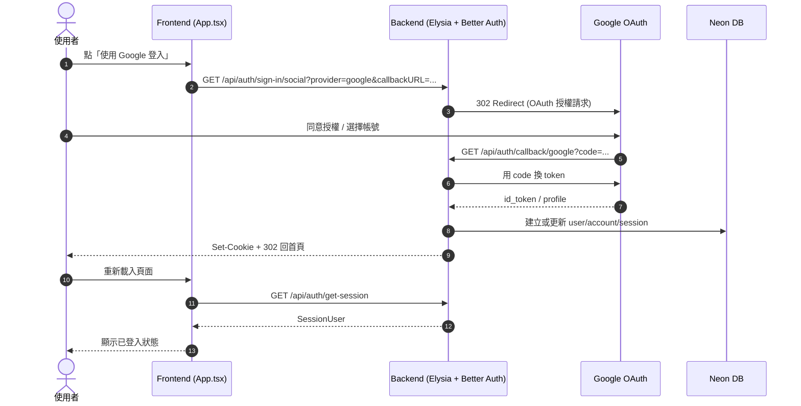
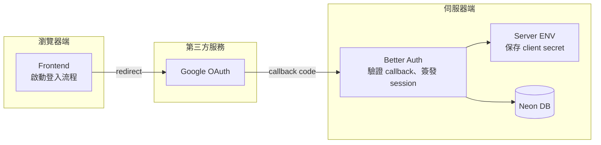
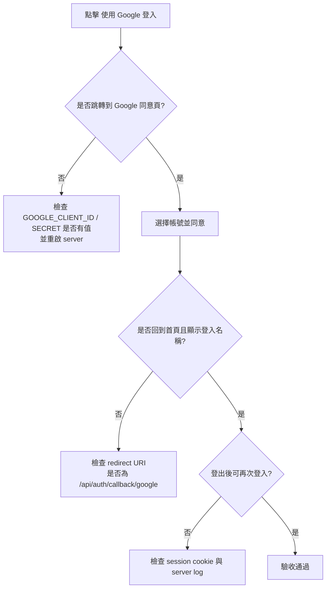

# V9 Better Auth 導入建置計畫（feat/v9-clean-better-auth）

> 目標分支：`feat/v9-clean-better-auth`（從 `feat/v8-clean-drizzle-neon-v2` 切出）  
> 當前階段：規劃確認，尚未進入功能實作。  
> 建議前置閱讀：`04_1_V7_V8_V9_重建升級路徑_實作清單.md`、`02_4_Schema一致性設計_Zod與Drizzle多層架構.md`

---

## 總導入原則

這四條原則是整個 V9 改造的底線，每個步驟都要對照確認：

1. **API 業務真相只在 `shared/contracts`（Zod）**：V8 已把 contracts.ts 改為 Zod schema，V9 新增的 auth session 型別也必須在同一層定義，不能讓 Better Auth 的內部型別直接當 API 回應型別。
2. **Drizzle schema 只負責資料落地，不自動等於 API contract**：Better Auth 會產生 `user / account / session` 等 DB 表，這些欄位結構是 DB 層事實，不是前端應該看到的全貌，兩者之間的轉換需要人工對齊，通常靠 AI 輔助完成。
3. **Route 只協調，不承擔身份真相**：V8 的 route 仍從前端接收 `userId` 並信任它，這是 V9 要根治的架構漏洞；身份真相改由 server session 擔任，route 只負責從 session 取出 user 再傳給 store。
4. **進版採 Expand-Contract 思維**：`bf_v9` 是新 schema，`bf_v8` 保留不動，先並存、驗收通過後才考慮收縮。

---

## Phase 0：基線凍結與備份

### 為什麼

你一貫的習慣是先有可回復點，避免 Better Auth 半套整合把業務功能也拖垮。auth 涉及的改動範圍橫跨 `backend.ts`、auth 模組、route 授權、前端狀態管理，任何一層改到中途卡住，都必須有可退的錨點。

### 做什麼

1. 確認 git 工作樹乾淨，沒有未追蹤的業務修改混入。
2. 建立版本化備份檔（與 `backend.v7-static-assets-guard.ts`、`backend.v8.ts` 同一慣例）。
3. 記錄導入前的 smoke baseline：`health`、`POST /api/auth/login`、`GET /api/orders/current`。

### 怎麼做

```bash
# 確認分支與乾淨狀態
git branch --show-current   # → feat/v9-clean-better-auth
git status -sb

# 建立備份（遵循現有命名慣例）
cp backend.ts backend.v9.pre-better-auth.ts

# 記錄 smoke baseline
curl http://localhost:3000/health
curl -X POST http://localhost:3000/api/auth/login \
  -H 'Content-Type: application/json' \
  -d '{"email":"demo@example.com","password":"1234"}'
curl 'http://localhost:3000/api/orders/current?userId=0001'
```

**驗收點**：備份檔存在，baseline 回應已記錄，工作樹乾淨。

---

## Phase 1：邊界與契約先定義（contracts 先行）

### 為什麼

V8 實錄（#010）已明確確認：改工具的順序是 **contracts → route → DB**，不能反過來。如果先把 Better Auth 的 DB tables 建起來、再去思考「那 API 應該回什麼」，就會讓 DB 結構悄悄倒流成 API 設計依據，重演 `02_4` 講義中「以 Drizzle 作為 single source」的反例。

Better Auth 的 `user` 物件欄位（`id / email / name / emailVerified / image / createdAt / updatedAt`）是 **DB 層事實**，不是 `SessionUser` 的全貌。V9 的 `SessionUser` 必須先在 `shared/contracts.ts` 明確定義「對外暴露哪些欄位」，再由 auth 轉換層負責 `BetterAuthUser → SessionUser`。

### 做什麼

1. 確認（或更新）`shared/contracts.ts` 中 `sessionUserSchema` 的欄位定義是否足夠支撐 V9。
2. 列出「哪些 API endpoint 從接受 `userId` 改成只讀 session」的完整清單（Contract Diff）。
3. 確認前端消費的 session 型別仍由 `shared/contracts.ts` export，前端直接 import，不重複定義。

### 怎麼做

**contracts.ts 變更評估**（先看現狀，再決定是否要加欄位）：

```ts
// 現況（V8）
export const sessionUserSchema = z.object({
  id: z.string().min(1),
  email: z.string().min(3),
  name: z.string().min(1),
  // password 永遠不在這裡
});

// V9 可能需要評估加入的欄位（視 UI 需求決定）
// emailVerified?: z.boolean()
// image?: z.string().url().optional()
// 原則：只加前端真的需要顯示的欄位，不把 Better Auth 的 DB user 整包搬過來
```

**Contract Diff 清單（預計）**：

| Endpoint                     | V8 身份來源      | V9 身份來源         | 說明                     |
| ---------------------------- | ---------------- | ------------------- | ------------------------ |
| `GET /api/orders/current`    | query `userId`   | server session      | route 自己從 session 取  |
| `POST /api/orders/:id/items` | body `userId`    | server session      | 同上                     |
| `PATCH /api/orders/:id`      | body `userId`    | server session      | 同上                     |
| `POST /api/auth/login`       | 由 DemoAuth 處理 | 由 Better Auth 處理 | 改為呼叫 Better Auth API |

**驗收點**：contracts.ts 決策確認（加 or 不加欄位），Contract Diff 清單確認。

---

## Phase 2：架構決策落版（先定策略，不動程式）

### 為什麼

Better Auth 有多種整合方式（session cookie / JWT、不同 adapter、不同 provider），一旦中途切換，migration 與 session 機制都要重來。先把這一版的決策固定，才能讓後續每步都有明確依據。

### 做什麼（固定三個決策）

**決策一：先跑通 email/password，Google OAuth 放第二階段**

- V9 第一階段的目標是「auth 架構閉環」，不是「登入方式多樣化」。
- email/password 最容易隔離測試，不依賴外部 OAuth 流程，適合先驗收。
- Google provider 的環境變數（`GOOGLE_CLIENT_ID` / `GOOGLE_CLIENT_SECRET`）與 callback URL 另開文件規劃。

**決策二：同庫同 schema，auth tables 與業務 tables 並存於 `bf_v9`**

- Better Auth 的 `user / account / session / verification` 表與業務的 `menu_items / orders / order_items` 表，都放在 `bf_v9` schema 下。
- 這樣 `orders.user_id` 的外鍵直接指向 `bf_v9.user.id`，不需要跨 schema JOIN，也不需要兩套 DB 連線。
- `bf_v8` 的業務表完全不動（Expand-Contract）。

**決策三：session 是唯一身份來源，前端不再宣告自己是誰**

- 這來自 `04_1` 實作紀錄 #011 的明確結論：前端 `localStorage user` 無法可靠承擔 session 一致性責任。
- V9 之後，後端受保護 API 完全移除對 query/body `userId` 的信任，改由 Better Auth session 判定。
- 前端只做 session 查詢與顯示，不再主動宣告「我是 userId=xxx」。

### 怎麼做

把上述三個決策寫進 ADR（架構決策紀錄），格式延續 `04_1` 的既有寫法，納入此文件作為後續實作的法源。

**驗收點**：三個決策確認並記錄，任何後續實作步驟有歧義時，優先回來看這裡。

---

## Phase 3：DB 與 Schema 對齊（人工介入 + AI 輔助）

### 為什麼

你已明確指出，Drizzle schema 與 contracts.ts 不會自動同步，必須人工介入。這在 V9 有兩個風險點：

1. Better Auth 會自己產生 auth tables 的定義，這套定義是 DB 層事實，不能直接當 API contract 使用。
2. 業務表（`orders.user_id`）原本是對照舊的 `users.id`，V9 要改對到 Better Auth 的 `user.id`，這個對齊必須人工確認。

延續 `04_1` 實作紀錄 #006 的 Expand-Contract 原則：migration 只建新表，不刪舊表；等驗收通過後才建獨立的清理 migration。

### 做什麼

1. 產生 Better Auth 所需的 auth tables（`user / account / session / verification`）在 `bf_v9` schema 下。
2. 更新業務表（`orders`）的 `user_id` 外鍵，使其指向新的 Better Auth `user.id`（`text` 型別，UUID）。
3. 建立三方對齊檢查表：每個核心欄位都對照 `contracts.ts` 名稱、route 輸入輸出、DB 欄位。
4. 檢查 seed/migrate 腳本中的裸字串 SQL，確保所有 schema prefix 正確（延續 #005 教訓）。

### 怎麼做

**三方對齊檢查表（先定義，再產生 migration）**：

| 業務概念     | contracts.ts                   | route I/O       | DB 欄位（bf_v9）                      |
| ------------ | ------------------------------ | --------------- | ------------------------------------- |
| 使用者 ID    | `SessionUser.id: string`       | session 取出    | `user.id: text` (UUID, PK)            |
| 使用者 email | `SessionUser.email: string`    | session 取出    | `user.email: text`                    |
| 使用者名稱   | `SessionUser.name: string`     | session 取出    | `user.name: text`                     |
| 訂單歸屬     | `OrderResponse.userId: string` | 從 session 注入 | `orders.user_id: text` FK → `user.id` |

**migration 策略**：

```text
0000_*.sql（V8 業務表，已存在）
→ 不動

0001_better_auth_tables.sql（Phase 3 新建）
→ CREATE TABLE bf_v9.user (...)
→ CREATE TABLE bf_v9.session (...)
→ CREATE TABLE bf_v9.account (...)
→ CREATE TABLE bf_v9.verification (...)
→ ALTER TABLE bf_v9.orders ADD CONSTRAINT fk_user FOREIGN KEY (user_id) REFERENCES bf_v9.user(id)
→ ❌ 沒有 DROP TABLE

0002_cleanup_old_users.sql（Phase 7 才建，確認穩定後執行）
→ DROP TABLE IF EXISTS bf_v9.users CASCADE（舊版業務 users 表）
```

**驗收點**：migration 執行成功、`bf_v9` 下四張 auth 表存在、業務表不受影響、對齊檢查表完整。

---

## Phase 4：Backend 整合（先 auth core，再修 route）

### 為什麼

先讓 auth 核心自己可以跑通，才不會在 auth 還沒驗證前就同時改爛業務 API。這是延續 `04_1` 多次實作紀錄的節奏：逐層驗收，不同時動兩層。

### 做什麼

**Step A：建立 auth core**

1. 新增 `auth/BetterAuth.ts`（或 `auth/better-auth.ts`），初始化 Better Auth server instance。
2. 在 Elysia 掛上 Better Auth handler（通常是一個 catch-all route）。
3. 建立 `getCurrentUser(request)` helper，供 route 取得目前 session user。
4. 新增 `GET /api/auth/session` smoke test 端點。

**Step B：修改受保護 route**

1. 訂單相關 API（`/api/orders/*`）改為：先呼叫 `getCurrentUser`，若 null 回 401；取到 user 後改用 `session.user.id` 做 ownership 判斷，完全移除對 body/query `userId` 的信任。
2. 更新 `shared/contracts.ts` 中相關 route 的 input schema（移除不再需要的 `userId` 欄位）。
3. 封存或刪除 `auth/DemoAuth.ts` 的對外暴露（保留備份供教學對照）。

### 怎麼做

```ts
// auth/BetterAuth.ts（概念結構，實作時再細化）
import { betterAuth } from "better-auth";
import { drizzleAdapter } from "better-auth/adapters/drizzle";
import { db } from "../db/client";

export const auth = betterAuth({
  database: drizzleAdapter(db, { provider: "pg" }),
  emailAndPassword: { enabled: true },
  // Google OAuth 放第二階段
});

// backend.ts 新增掛載（概念結構）
app.all("/api/auth/*", ({ request }) => auth.handler(request));

// session helper（概念結構）
export async function getCurrentUser(
  request: Request,
): Promise<SessionUser | null> {
  const session = await auth.api.getSession({ headers: request.headers });
  if (!session?.user) return null;
  // DbUser → SessionUser 轉換（對齊 contracts.ts）
  return {
    id: session.user.id,
    email: session.user.email,
    name: session.user.name,
  };
}
```

**驗收點**：`GET /api/auth/session`（未登入回 null / 401），受保護 API 未登入回 401，登入後回 200。

---

## Phase 5：Frontend 整合（session 成為唯一身份來源）

### 為什麼

`04_1` 實作紀錄 #011 已清楚記錄：前端 `localStorage user` 當身份來源的根本問題是「非同步請求晚到可能覆寫新帳號的狀態」。這個問題在 V8 用臨時修補止血，V9 要從根本移除這條依賴路徑。

### 做什麼

1. 建立 auth client（前端 `better-auth/client`）。
2. App 啟動時先驗 session（`auth.useSession()` 或等效），再載入業務資料。
3. 「我是誰」的狀態來源改為 session API 回傳，移除所有從 `localStorage` 讀 user 的邏輯。
4. 401/403 回應統一觸發：清除前端暫存 → 回登入頁 → 重抓 current order。

### 怎麼做

```ts
// frontend 概念結構
import { createAuthClient } from "better-auth/client";

const authClient = createAuthClient({
  baseURL: import.meta.env.VITE_API_URL ?? "http://localhost:3000",
});

// App 初始化流程
const { data: session } = await authClient.useSession();
if (!session) {
  // 未登入，顯示登入頁
} else {
  // 已登入，從 session 取 user，再去拉業務資料
  const currentUser: SessionUser = {
    id: session.user.id,
    email: session.user.email,
    name: session.user.name,
  };
  // 業務資料請求不再帶 userId，由後端從 session 判斷
}
```

**驗收點**：前端不再有從 `localStorage` 讀 `userId` 的路徑、切換帳號後 session 立即更新、401/403 統一回到登入頁。

---

## Phase 6：驗收矩陣與部署確認

### 為什麼

Auth 導入最怕「本地跑得通、deploy 後靜默壞掉」——可能是 secret 沒設、callback URL 不對、或 schema 指向錯誤（延續 #008 的教訓：有 fallback 的環境變數特別危險）。

### 做什麼

**最小驗收矩陣**：

| 測試情境                                         | 預期結果              |
| ------------------------------------------------ | --------------------- |
| 未登入打 `GET /api/orders/current`               | `401 Unauthorized`    |
| 登入後打同一 API                                 | `200` + 訂單資料      |
| A 帳號登入後打 B 帳號的訂單                      | `403 ORDER_NOT_OWNED` |
| server 重啟後打受保護 API（有效 session cookie） | `200`                 |
| server 重啟後打受保護 API（無 session）          | `401`                 |
| `POST /api/auth/register`（新帳號）              | `200` + session       |
| `POST /api/auth/login`（錯誤密碼）               | `401`                 |

**部署前環境變數清單**（延續 #008 格式）：

| 變數名稱                 | 說明                           | 忘記設定的後果                         |
| ------------------------ | ------------------------------ | -------------------------------------- |
| `DATABASE_URL`           | Neon pooler 連線（runtime 用） | 啟動失敗                               |
| `DATABASE_URL_MIGRATION` | Neon 直連（migration 用）      | migration 失敗                         |
| `STORE_DRIVER`           | 必須為 `postgres`              | 走 JSON，auth 完全無效                 |
| `PG_SCHEMA`              | 必須為 `bf_v9`                 | 靜默走錯 schema                        |
| `BETTER_AUTH_SECRET`     | session 簽名金鑰               | session 無法驗證                       |
| `BETTER_AUTH_URL`        | callback base URL              | OAuth 流程失敗（目前 email/pw 不影響） |

**Rollback 預案**：

- 切回 `feat/v8-clean-drizzle-neon-v2` 分支。
- 改環境變數 `PG_SCHEMA=bf_v8`，業務資料仍在，不需還原資料庫。
- auth tables（`bf_v9` 新建的）不影響 V8 業務運作。

**驗收點**：所有矩陣測試通過、部署環境 secrets 對齊、rollback 流程已驗證可行。

---

## 建議實作順序（口訣）

```text
contracts → DB migration → auth core → route → frontend → smoke + deploy
```

這個順序和 V7→V8 實作的慣例完全一致：**先定義介面，再實作底層，最後才動外層**。

---

## 決策確認紀錄（2026-04-29）

以下四點均已由老師確認，作為後續所有實作的法源。

1. **V9 第一階段先做 email/password，Google OAuth 放第二階段**。✅
2. **受保護 API 全面改為只信任 server session**，移除對 query/body `userId` 的信任。✅
3. **短期保留 DemoAuth 備份供教學對照，但對外路徑完全切換到 Better Auth**。✅
4. **Phase 0 + Phase 1 先備份與確認 contracts，不先動業務程式碼**。✅

---

## 實作紀錄 #V9-001（Phase 0：基線凍結與備份）

- 日期：2026-04-29
- 分支：`feat/v9-clean-better-auth`
- commit：`bc70e21`

### 執行內容

1. 確認工作樹乾淨（`git status -sb` 無未追蹤業務修改）。
2. 建立版本化備份：`cp backend.ts backend.v9.pre-better-auth.ts`，延續 `backend.v7-*`、`backend.v8.ts` 的既有命名慣例。
3. 提交備份檔至版本控制，建立可回復節點。

### 備份檔現況

```
backend.v7-static-assets-guard.ts  ← V7 靜態資產保護版
backend.v8.ts                       ← V8 示範版
backend.v9.pre-better-auth.ts       ← ✅ 本次新增，V9 導入 Better Auth 前的基線
backend.ts                          ← 正在改造的主線
```

### 教學口訣（延續舊版）

> 改造前先備份，備份名稱就是版本日誌。看到 `backend.v*.ts` 就知道改了幾次。

---

## 實作紀錄 #V9-002（Phase 1：Contract Diff 清單確認）

- 日期：2026-04-29
- 分支：`feat/v9-clean-better-auth`

### 結論：`shared/contracts.ts` 不需要異動

`sessionUserSchema` 目前的 `{ id, email, name }` 已足夠 V9 第一階段使用。

Better Auth 的 `user` 物件包含 `emailVerified / image / createdAt / updatedAt` 等 DB 層欄位，這些欄位屬於 DB 層事實，V9 前端第一階段不需要顯示，**不進 contracts**。此決策延續 `02_4` 講義的核心原則：DB 層欄位不直接等於 API contract。

`orderSchema` 裡的 `userId` 欄位**保留**（它是業務資料結構的一部分，代表訂單歸屬），但 route 的 **input schema** 需移除前端傳入的 `userId`（由 server session 注入，不再由前端宣告）。

### Contract Diff 清單

| Endpoint                      | V8 userId 來源                   | V9 改為                    | route input schema 異動               |
| ----------------------------- | -------------------------------- | -------------------------- | ------------------------------------- |
| `POST /api/auth/login`        | body → DemoAuth 驗證             | → Better Auth 接管整條     | route 整段由 Better Auth handler 取代 |
| `GET /api/orders/current`     | query `userId`（前端傳入）       | server session 取出        | **移除** query `userId`               |
| `GET /api/orders/history`     | query `userId`（前端傳入）       | server session 取出        | **移除** query `userId`               |
| `POST /api/orders`            | body `userId`（前端傳入）        | server session 取出        | **移除** body `userId`                |
| `GET /api/orders/:id`         | query `userId`（ownership 比對） | session user id 比對       | **移除** query `userId`               |
| `PATCH /api/orders/:id`       | body `userId`（ownership 比對）  | session user id 比對       | **移除** body `userId`                |
| `POST /api/orders/:id/submit` | body `userId`（ownership 比對）  | session user id 比對       | **移除** body `userId`                |
| `GET /api/orders`             | 無 userId                        | 維持（可選加 admin guard） | 不改                                  |
| `GET /api/menu`               | 無 userId                        | 維持公開                   | 不改                                  |
| `GET /health`                 | 無 userId                        | 維持公開                   | 不改                                  |

### 教學結論

> 這張表就是「V9 的邊界宣告」：哪些 endpoint 要加守衛、哪些維持公開，在動任何程式碼前先對齊。
> 後續每一個 route 改動都應該對照這張表，不能改超出範圍，也不能漏改。

---

## 實作紀錄 #V9-003（Phase 2：套件安裝與環境設定）

- 日期：2026-04-29
- 分支：`feat/v9-clean-better-auth`

### 執行內容

1. **安裝 `better-auth` 套件**（根目錄 + frontend）：

   ```bash
   bun add better-auth           # → better-auth@1.6.9（root）
   cd frontend && bun add better-auth  # → better-auth@1.6.9（frontend）
   ```

   > **重要發現**：`drizzleAdapter` 直接從 `"better-auth/adapters/drizzle"` import，
   > **不是** `@better-auth/drizzle-adapter`（那是舊版，已棄用）。
   > Better Auth 1.x 已內建所有 adapter，不需另裝套件。

2. **更新 `.env`**：

   ```bash
   PG_SCHEMA=bf_v9
   BETTER_AUTH_URL=http://localhost:3000
   BETTER_AUTH_SECRET=<64 char hex, generated by openssl/crypto>
   ```

   清除重複行，確認無 `replaceme` 佔位值。

3. **更新 `.env.example`**，新增 Better Auth 區塊（含中文說明）。

4. **建立 `auth/better-auth.ts`**：Better Auth server instance scaffold，含啟動守衛（startup guard）：

   ```ts
   import { betterAuth } from "better-auth";
   import { drizzleAdapter } from "better-auth/adapters/drizzle";
   import { db } from "../db/client.ts";
   import * as schema from "../db/auth-schema.ts";
   import type { SessionUser } from "../shared/contracts.ts";

   // 啟動守衛：缺少或仍是 placeholder 的 secret → 直接 throw
   const secret = process.env.BETTER_AUTH_SECRET;
   if (!secret || secret === "replaceme") {
     throw new Error(
       "[better-auth] BETTER_AUTH_SECRET is missing or insecure.",
     );
   }

   export const auth = betterAuth({
     baseURL: process.env.BETTER_AUTH_URL ?? "http://localhost:3000",
     secret,
     database: drizzleAdapter(db, { provider: "pg", schema }),
     emailAndPassword: { enabled: true },
   });

   export async function getCurrentUser(
     request: Request,
   ): Promise<SessionUser | null> {
     const session = await auth.api.getSession({ headers: request.headers });
     if (!session?.user) return null;
     return {
       id: session.user.id,
       email: session.user.email,
       name: session.user.name,
     };
   }
   ```

### 教學重點：`SessionUser` 是橋樑層

`getCurrentUser()` 的回傳型別是 `SessionUser`（定義在 `shared/contracts.ts`），而非 Better Auth 內部型別。這個轉換動作，就是把「DB 層事實」翻譯成「API contract 語言」的關鍵一步。路由層只會看到 `SessionUser`，看不到 `emailVerified`、`image` 等 DB 欄位，職責清晰。

### 驗收點

- ✅ `better-auth@1.6.9` 安裝成功（root + frontend）
- ✅ `.env` 含三個新變數，無重複、無 placeholder
- ✅ `auth/better-auth.ts` 存在，有 startup guard
- ✅ `auth/better-auth.ts` import `"../db/auth-schema.ts"`（Phase 3 前尚不存在，Phase 3 完成後解除）

---

## 實作紀錄 #V9-004（Phase 3：DB Schema + Migration）

- 日期：2026-04-29
- 分支：`feat/v9-clean-better-auth`

### 執行內容

#### Step A：建立 `db/auth-schema.ts`

手動依照 Better Auth 1.x 官方 Core Schema 規格建立四張 auth 表，使用 `pgSchema(process.env.PG_SCHEMA ?? "public")` 套入 `bf_v9` 命名空間。

```ts
// db/auth-schema.ts（節錄結構）
const appSchema = pgSchema(process.env.PG_SCHEMA ?? "public");

export const user = appSchema.table("user", { ... });         // Better Auth 主表
export const session = appSchema.table("session", { ... });   // 登入 session
export const account = appSchema.table("account", { ... });   // 認證帳號（email/pw + OAuth）
export const verification = appSchema.table("verification", { ... }); // email 驗證
```

**欄位對照（Better Auth 1.x 官方規格）**：

| 表名           | 主要欄位                                                                                                          |
| -------------- | ----------------------------------------------------------------------------------------------------------------- |
| `user`         | id(text PK), name, email(unique), emailVerified(bool), image?, createdAt, updatedAt                               |
| `session`      | id(text PK), userId(FK→user), token(unique), expiresAt, ipAddress?, userAgent?, createdAt, updatedAt              |
| `account`      | id(text PK), userId(FK→user), accountId, providerId, accessToken?, refreshToken?, password?, createdAt, updatedAt |
| `verification` | id(text PK), identifier, value, expiresAt, createdAt?, updatedAt?                                                 |

> **設計決策**：`user` 表使用**單數**名稱（Better Auth 預設），業務表 `users` 繼續保留（不立即棄用），兩者共存於 `bf_v9`。

#### Step B：更新 `drizzle.config.ts`

```ts
// 從單一 schema 改為陣列，讓 drizzle-kit 同時掃兩個檔
schema: ["./db/schema.ts", "./db/auth-schema.ts"],
```

#### Step C：更新 `db/client.ts`

```ts
import * as authSchema from "./auth-schema.ts";
// 合併傳入 drizzle，讓 ORM 能感知所有表
export const db = drizzle({
  client: pool,
  schema: { ...schema, ...authSchema },
});
```

#### Step D：產生 Migration SQL

```bash
PG_SCHEMA=bf_v9 bun run db:generate
# → drizzle/0001_luxuriant_toad.sql（8 張 bf_v9 表 + 4 個 FK + 1 個 index）
```

> **關鍵操作**：drizzle-kit 因偵測到 bf_v8→bf_v9 schema 變更，自動在 SQL 中插入 `DROP TABLE "bf_v8".*` 語句。**立即手動將這四行改為 comment**，延續 Expand-Contract 原則：
>
> ```sql
> -- [Expand-Contract] bf_v8 tables are intentionally preserved for rollback safety.
> -- DO NOT DROP: DROP TABLE "bf_v8"."menu_items" CASCADE;
> -- ...
> ```

#### Step E：執行 Migration

```bash
bun run db:migrate  # ← 已知問題 #005：@neondatabase/serverless WebSocket 靜默失敗
```

**備案（延續 #005 教訓）**：直接用 inline Bun 腳本讀取 SQL 並透過 Pool + ws 執行：

```bash
PG_SCHEMA=bf_v9 bun -e "
  import { neonConfig, Pool } from '@neondatabase/serverless';
  import ws from 'ws';
  neonConfig.webSocketConstructor = ws;
  // ... 讀 0001 SQL，逐 statement 執行
" 2>&1
```

結果：全部 14 個 statement 執行成功。

### 重點教訓：drizzle-kit 的跨 schema DROP 行為

當 drizzle-kit 在 `drizzle/meta/_journal.json` 裡看到上一個 migration 建立了 `bf_v8.*` 的表，而這次的 schema 定義全部改成 `bf_v9.*`，它會自動產生 `DROP TABLE "bf_v8".*` 的語句——邏輯上沒錯，但在我們的教學情境（Expand-Contract，保留 V8 資料）這是危險動作。

**守則**：每次跨 schema migrate 產生 SQL 後，必須人工 review DROP 語句再執行。

### Phase 3 完成後的 DB 現況

```
bf_v8（舊，保留）
  ├── menu_items
  ├── order_items
  ├── orders
  └── users

bf_v9（新）
  ├── menu_items     ← 業務表（空表，需 seed）
  ├── order_items    ← 業務表
  ├── orders         ← 業務表（FK → bf_v9.users）
  ├── users          ← 業務表（舊 auth，V9 過渡期間保留）
  ├── user           ← Better Auth 主表 ✅ NEW
  ├── session        ← Better Auth session ✅ NEW
  ├── account        ← Better Auth 帳號 ✅ NEW
  └── verification   ← Better Auth email 驗證 ✅ NEW
```

> **FK 注意事項**：目前 `bf_v9.orders.user_id` FK 指向 `bf_v9.users`（舊業務 users 表），
> **不是** `bf_v9.user`（Better Auth 新表）。
> Phase 4 整合完成後，需要評估是否要遷移這個 FK 指向；V9 第一階段先保持現狀，
> 讓 `store.createOrder()` 繼續用 Better Auth 的 `user.id` 當 `userId` 存入即可
> （因為兩張表的 id 都是 text，只要 store 層用正確的 id 寫入就不會違反 FK）。

### 驗收點

- ✅ `db/auth-schema.ts` 建立，4 張 auth 表定義正確
- ✅ `drizzle.config.ts` 加入 auth-schema 路徑
- ✅ `db/client.ts` schema 合併傳入
- ✅ `drizzle/0001_luxuriant_toad.sql` 產生，DROP 語句已改為 comment
- ✅ Migration 執行成功（bf_v9 下 8 張表皆存在，bf_v8 未受影響）

---

## 實作紀錄 #V9-005（Phase 4：整合 Better Auth Handler，移除路由 userId 信任）

- 日期：2026-04-29
- 分支：`feat/v9-clean-better-auth`

### 執行目標

將 `backend.ts` 中舊的 `DemoAuth` 認證系統完全移除，改用 Better Auth 作為唯一認證來源。所有訂單相關路由（6 條）改為透過 `getCurrentUser(request)` 從 session 取得使用者身份，不再信任前端傳來的 `userId`。

### 變更項目

#### A. Import 層（頭部）

```ts
// 移除
import { createAuth } from "./auth/DemoAuth.ts";

// 新增
import { auth, getCurrentUser } from "./auth/better-auth.ts";
```

#### B. App 啟動段

```ts
// 移除（DemoAuth 需要 init，Better Auth 是無狀態的）
// const auth = createAuth(...);
// await auth.init();
```

#### C. Better Auth Handler 掛載（路由衝突診斷與解法）

**第一次嘗試（失敗）：`app.all()`**

```ts
app.all("/api/auth/*", ({ request }) => auth.handler(request));
```

原因：Elysia 1.4.x 的 `all()` 不捕捉 GET 方法。

**第二次嘗試（部分成功）：`app.mount()`**

```ts
app.mount("/api/auth", auth.handler);
```

現象：無 cookie 時 GET 正常（200 null）；有 cookie 時被 SPA wildcard 截走（回傳 HTML）。

**第三次嘗試（成功）：明確 `get()` + `post()`**

```ts
app.get("/api/auth/*", ({ request }) => auth.handler(request));
app.post("/api/auth/*", ({ request }) => auth.handler(request));
```

**根本原因分析**：Elysia 1.4.x 中，`mount()` 掛載的路由**優先順序低於** `use(staticPlugin(...))` 或 `get("*")` SPA wildcard。明確的 `get("/api/auth/*")` 屬於具名路由，優先順序**高於** `get("*")`，因此可以在 SPA wildcard 之前攔截請求。

**SPA fallback 同步修改**（防止 `/api/` 路徑被 SPA 誤吃）：

```ts
app.get("*", async ({ request }) => {
  const pathname = new URL(request.url).pathname;
  if (pathname.startsWith("/api/")) {
    // 具名路由未能匹配的 /api/ 路徑 → 直接 404
    return new Response(JSON.stringify({ error: "Not found" }), {
      status: 404,
      headers: { "Content-Type": "application/json" },
    });
  }
  // ...原 SPA 邏輯不變...
});
```

#### D. 訂單路由改寫（共 6 條）

舊方式：從 request body / query params 讀取 `userId`（前端可任意偽造）

新方式：`await getCurrentUser(request)` 從 session cookie 取得身份，無 session → 401

| 路由                          | 舊方式         | 新方式                    |
| ----------------------------- | -------------- | ------------------------- |
| `GET /api/orders/current`     | `query.userId` | `getCurrentUser(request)` |
| `GET /api/orders/history`     | `query.userId` | `getCurrentUser(request)` |
| `POST /api/orders`            | `body.userId`  | `getCurrentUser(request)` |
| `GET /api/orders/:id`         | `query.userId` | `getCurrentUser(request)` |
| `PATCH /api/orders/:id`       | `body.userId`  | `user.id`（from session） |
| `POST /api/orders/:id/submit` | `body.userId`  | `user.id`（from session） |

`getCurrentUser()` 實作（在 `auth/better-auth.ts`）：

```ts
export async function getCurrentUser(
  request: Request,
): Promise<SessionUser | null> {
  const session = await auth.api.getSession({ headers: request.headers });
  if (!session?.user) return null;
  return {
    id: session.user.id,
    email: session.user.email,
    name: session.user.name,
  };
}
```

### Phase 4 E2E 驗收測試結果

| 測試項目                                         | 結果                                             |
| ------------------------------------------------ | ------------------------------------------------ |
| `GET /health`                                    | ✅ 200                                           |
| `GET /api/orders/current`（無 session）          | ✅ 401                                           |
| `GET /api/auth/get-session`（無 cookie）         | ✅ 200 `null`                                    |
| `POST /api/auth/sign-in/email`                   | ✅ 200 + Set-Cookie                              |
| `GET /api/auth/get-session`（帶 session cookie） | ✅ 200 `{"session":{...},"user":{...}}`          |
| `GET /api/orders/current`（帶 session cookie）   | ✅ 200（session 有效，無訂單則 `{"data":null}`） |
| `bun build ./backend.ts`（編譯）                 | ✅ 1013 modules, 3.0 MB                          |

### 重點教訓：`app.mount()` vs 明確路由的優先順序

在 Elysia 1.4.x + `staticPlugin` 的組合下，`mount()` 掛載的 handler 在存在 `get("*")` SPA wildcard 時**會被截走**。這不是 Cookie 的問題，而是路由優先順序問題：

- `use(staticPlugin(...))` → 早期掛載，內部可能有 wildcard
- `get("*")` → 最末端 SPA fallback，為了讓前端 SPA 路由工作而必要
- `mount("/api/auth", ...)` → 優先順序**低於** `get("*")`（含 cookie 的請求證明了這點）
- `get("/api/auth/*")` → 具名路由，優先順序**高於** `get("*")` ✅

**結論**：在 Elysia 1.4.x 中，若專案有 SPA wildcard，必須用明確的 `get()` + `post()` 掛載 Better Auth handler，不能用 `mount()` 或 `all()`。

### 驗收點

- ✅ `backend.ts` 移除 `DemoAuth` import，改用 `auth, getCurrentUser` from `./auth/better-auth.ts`
- ✅ `app.get("/api/auth/*")` + `app.post("/api/auth/*")` 正確掛載
- ✅ SPA fallback 已加入 `/api/` 路徑排除邏輯
- ✅ 6 條訂單路由全部改用 `getCurrentUser(request)` 取得身份
- ✅ 路由 schema 中 `userId` 欄位已從 body/query 移除
- ✅ 完整 E2E 流程驗證通過（sign-in → get-session → protected route）

---

## 實作紀錄 #V9-006（Phase 4.5：移除 bf_v9.users，FK 完整遷移至 Better Auth）

- 日期：2026-04-29
- 分支：`feat/v9-clean-better-auth`

### 決策背景

導入 Better Auth 後，`bf_v9.users` 成為無人信任的影子表：

- Better Auth 的身份來源是 `bf_v9.user`（Better Auth 管理）
- `bf_v9.orders.user_id` FK 還指向 `bf_v9.users`（舊表）
- `DemoAuth.ts` / `Auth.ts` / `PgAuth.ts` 已無任何 import 引用

保留這些等於維持技術債與規格債。完整遷移是唯一正確選項。

### 變更項目

#### A. `db/schema.ts`

```ts
// 移除
export const usersTable = appSchema.table("users", { ... });
// ordersTable.userId FK 舊指向
.references(() => usersTable.id)

// 新增 import
import { user } from "./auth-schema.ts";

// ordersTable.userId FK 改指向
.references(() => user.id)
```

#### B. `store/pg/PgStore.ts`

```ts
// 移除
import { usersTable } from "../../db/schema.ts"; // 從 import 移除

// seedFromJsonIfEmpty() 重構：
// 舊：count(*) from usersTable → seed users + menu + orders
// 新：count(*) from menuItemsTable → 只 seed menu
//
// 原因：
//   1. users 表已移除，不存在 usersTable
//   2. orders seed data 的 user_id（如 "0001"）在 bf_v9.user 不存在
//      → 強制播入會觸發 FK violation
//   3. V9 設計：使用者由 Better Auth 管理，orders 需真實 session 才能建立
```

#### C. `auth/` 目錄清理

| 刪除檔案            | 原用途                                        |
| ------------------- | --------------------------------------------- |
| `auth/Auth.ts`      | V8 Auth 介面定義                              |
| `auth/DemoAuth.ts`  | JSON 檔案模擬 auth                            |
| `auth/index.ts`     | createAuth() 工廠函式（依 STORE_DRIVER 切換） |
| `auth/pg/PgAuth.ts` | PostgreSQL 版 auth（查 bf_v9.users）          |

保留：`auth/better-auth.ts`（V9 唯一 auth 來源）

#### D. Migration SQL（`drizzle/0002_unique_outlaw_kid.sql`）

```sql
-- drizzle-kit generate 產生（7 tables 確認，usersTable 不在其中）
ALTER TABLE "bf_v9"."users" DISABLE ROW LEVEL SECURITY;
DROP TABLE "bf_v9"."users" CASCADE;
ALTER TABLE "bf_v9"."orders" DROP CONSTRAINT "orders_user_id_users_id_fk";
ALTER TABLE "bf_v9"."orders" ADD CONSTRAINT "orders_user_id_user_id_fk"
  FOREIGN KEY ("user_id") REFERENCES "bf_v9"."user"("id")
  ON DELETE no action ON UPDATE no action;
```

**執行時遇到的問題與解法**：

| 問題                                | 原因                                                             | 解法                                     |
| ----------------------------------- | ---------------------------------------------------------------- | ---------------------------------------- |
| DROP CONSTRAINT 失敗                | `CASCADE DROP TABLE` 已一併刪掉 FK                               | 跳過，只執行 ADD CONSTRAINT              |
| ADD CONSTRAINT 失敗（FK violation） | `orders` 裡有舊測試資料 `user_id='0001'`，在 `bf_v9.user` 不存在 | 先 DELETE 孤兒 orders，再 ADD CONSTRAINT |

```sql
-- 清除孤兒 orders（order_items 有 ON DELETE CASCADE，自動清除）
DELETE FROM "bf_v9"."orders"
WHERE user_id NOT IN (SELECT id FROM "bf_v9"."user");
-- → 刪除 5 筆舊測試資料
```

### Phase 4.5 完成後的 DB 現況

```
bf_v8（舊，保留）
  ├── menu_items
  ├── order_items
  ├── orders
  └── users          ← V8 業務 users，未動

bf_v9（新，完全 Better Auth 化）
  ├── menu_items     ← 業務表（已 seed）
  ├── order_items    ← 業務表（FK → orders）
  ├── orders         ← 業務表（FK → bf_v9.user ✅）
  ├── user           ← Better Auth 主表（唯一身份來源）
  ├── session        ← Better Auth session
  ├── account        ← Better Auth 帳號
  └── verification   ← Better Auth email 驗證
  -- users 表：已 DROP ✅
```

### E2E 驗收測試結果

| 測試項目                                  | 結果                                    |
| ----------------------------------------- | --------------------------------------- |
| `GET /api/auth/get-session`（無 cookie）  | ✅ 200 `null`                           |
| `POST /api/auth/sign-in/email`            | ✅ 200 + Set-Cookie                     |
| `GET /api/auth/get-session`（有 cookie）  | ✅ 200 `{"session":{...},"user":{...}}` |
| `GET /api/orders/current`（有 session）   | ✅ 200                                  |
| `POST /api/orders`（有 session，空 body） | ✅ 200（無 FK violation）               |
| `bun build ./backend.ts`                  | ✅ 1013 modules, 3.0 MB                 |

### 重點教訓：CASCADE DROP 的連鎖效應

執行 `DROP TABLE "bf_v9"."users" CASCADE` 時，PostgreSQL 自動刪除所有以 `users` 為目標的 FK constraint（含 `orders_user_id_users_id_fk`）。drizzle-kit 產生的 SQL 仍包含明確的 DROP CONSTRAINT，在 CASCADE 已執行後會報錯「constraint does not exist」。

**守則**：多步驟 migration 中，若某步驟用了 CASCADE，後續與該表相關的 DROP CONSTRAINT 可能已自動完成，要逐一確認後再執行。

### 驗收點

- ✅ `db/schema.ts` 無 `usersTable`，`ordersTable.userId` FK → `bf_v9.user`
- ✅ `store/pg/PgStore.ts` 無任何 `usersTable` 引用，seed 改為 menu-only
- ✅ `auth/Auth.ts`, `auth/DemoAuth.ts`, `auth/index.ts`, `auth/pg/PgAuth.ts` 全部刪除
- ✅ `drizzle/0002_unique_outlaw_kid.sql` 產生，drizzle meta 同步
- ✅ `bf_v9.users` 已 DROP，`orders.user_id` FK 指向 `bf_v9.user`
- ✅ 孤兒 orders（5 筆）清除，FK 無 violation
- ✅ E2E 完整流程驗證通過

---

## Phase 5：前端 Auth Client 整合（localStorage → Session Cookie）

> commit: `0d95209`（feat/v9-clean-better-auth）  
> 對應教學紀錄：`#V9-007`

### 為什麼（Before）

Phase 4 完成了 **server 端** 的 Better Auth 整合：後端已不再信任前端傳來的 `userId`，所有路由改由 session cookie 識別使用者。但 **前端 App.tsx 還停留在 V8 思維**：

- 登入呼叫舊的 `/api/auth/login`（V8 DemoAuth endpoint，已刪除）
- 登入成功後把 `{id, email, name}` 寫進 `localStorage`，頁面刷新時從 localStorage 讀回（假設 server 仍然信任）
- 每次 API 呼叫都在 query string 或 body 裡附帶 `userId`
- 登出只做 `localStorage.removeItem`，不通知 server

這個組合造成根本性的安全缺口：**任何人可以在 localStorage 偽造 userId**，server 不做任何 session 驗證。

### 做什麼（實作清單）

#### Step 1：移除 V8 localStorage 殘留

```diff
- const USER_STORAGE_KEY = "breakfast.user";

// useEffect session restore:
- const savedUser = window.localStorage.getItem(USER_STORAGE_KEY);
- if (savedUser) { ... setUser(JSON.parse(savedUser)); }
+ // V9: 改為 GET /api/auth/get-session（帶 credentials: 'include'）
```

#### Step 2：Session 恢復從 Cookie 取

頁面掛載時（`useEffect`）向 server 問當前 session，而不讀本地儲存：

```ts
async function restoreSession() {
  const res = await fetch(buildApiUrl("/api/auth/get-session"), {
    credentials: "include", // 帶上 session cookie
  });
  if (res.ok) {
    const data = await res.json(); // null 或 { user, session }
    if (data?.user) setUser(data.user);
  }
}
void restoreSession();
```

#### Step 3：登入改呼叫 Better Auth endpoint

| 項目     | V8                      | V9                                       |
| -------- | ----------------------- | ---------------------------------------- |
| 路徑     | `POST /api/auth/login`  | `POST /api/auth/sign-in/email`           |
| 回應格式 | `{ data: SessionUser }` | `{ user: SessionUser, token: string }`   |
| 後續動作 | 寫入 localStorage       | Server 已自動設 Set-Cookie，直接 setUser |

```ts
// V9 登入寫法
const response = await fetch(buildApiUrl("/api/auth/sign-in/email"), {
  method: "POST",
  headers: { "Content-Type": "application/json" },
  credentials: "include", // 必須：讓瀏覽器接收 Set-Cookie
  body: JSON.stringify({ email, password }),
});
const payload = await response.json(); // { user, token, ... }
setUser(payload.user); // 不再寫 localStorage
```

#### Step 4：登出通知 Server 清 Cookie

```ts
// V9 登出寫法
async function handleLogout() {
  await fetch(buildApiUrl("/api/auth/sign-out"), {
    method: "POST",
    credentials: "include", // 帶 cookie 讓 server 知道要清哪一筆
  });
  setUser(null);
}
```

> **Note**：`sign-out` 有 CSRF 保護，需要 `Origin` header 與 `BETTER_AUTH_URL` 匹配。瀏覽器同源 fetch 自動帶 `Origin`，不需手動設定。`curl` 測試時需加 `-H 'Origin: http://localhost:3000'`。

#### Step 5：所有 API 呼叫移除 userId，加入 credentials

```diff
// loadCurrentOrder
- fetch(`/api/orders/current?userId=${userId}`)
+ fetch(`/api/orders/current`, { credentials: "include" })

// loadOrderHistory
- fetch(`/api/orders/history?userId=${userId}`)
+ fetch(`/api/orders/history`, { credentials: "include" })

// ensureOrder (POST /api/orders)
- body: JSON.stringify({ userId: user.id })
+ body: JSON.stringify({})
  credentials: "include"   // 新增

// addToCart / clearCart (PATCH /api/orders/:id)
- body: JSON.stringify({ userId: user.id, itemId, qty })
+ body: JSON.stringify({ itemId, qty })
  credentials: "include"   // 新增

// submitOrder (POST /api/orders/:id/submit)
- body: JSON.stringify({ userId: user.id })
+ body: JSON.stringify({})
  credentials: "include"   // 新增
```

#### Step 6：更新 function 簽名（移除 userId 參數）

```diff
- async function loadCurrentOrder(targetUserId: string): Promise<Order | null>
+ async function loadCurrentOrder(): Promise<Order | null>

- async function loadOrderHistory(targetUserId: string): Promise<void>
+ async function loadOrderHistory(): Promise<void>

- async function refreshUserOrders(targetUserId: string): Promise<void>
+ async function refreshUserOrders(): Promise<void>
```

### 關鍵概念：為什麼 `credentials: 'include'` 這麼重要

瀏覽器的 `fetch()` 預設行為（`credentials: 'same-origin'）`：只有當請求目標與頁面同 origin 時才帶 cookie。

但在開發環境下，Vite Dev Server（port 5173）呼叫 Elysia Server（port 3000），屬於跨 origin，cookie 不會自動附帶。

**解法**：

1. **前端**：`fetch(..., { credentials: 'include' })` — 強制帶 cookie
2. **後端**：`cors({ credentials: true, origin: ... })` — 允許跨 origin 攜帶憑證
3. **Better Auth**：`trustedOrigins` 設定允許 dev origin

在 production（前端 build 結果由同一個 Elysia server 提供靜態檔案），前後端同 origin，`credentials: 'include'` 仍然正確（同 origin 請求也能帶 cookie）。

### E2E 驗證矩陣

| 步驟         | 呼叫                                             | 預期結果         |
| ------------ | ------------------------------------------------ | ---------------- |
| 無 cookie    | `GET /api/auth/get-session`                      | `null`           |
| 登入         | `POST /api/auth/sign-in/email {email, password}` | 200，Set-Cookie  |
| Session 確認 | `GET /api/auth/get-session`（帶 cookie）         | `{user:{email}}` |
| 當前訂單     | `GET /api/orders/current`（帶 cookie）           | 200              |
| 建立訂單     | `POST /api/orders` body `{}`（帶 cookie）        | 200              |
| 登出         | `POST /api/auth/sign-out`（帶 cookie）           | 200              |
| 登出後       | `GET /api/orders/current`（無效 cookie）         | 401              |

### 重點教訓：sign-out 的 CSRF 保護

Better Auth 的 `sign-out` endpoint 會驗證 `origin` header，若 origin 不在 `trustedOrigins` 白名單內，回 403。

- **瀏覽器**：同源 fetch 自動附帶正確 origin → 200 ✅
- **curl**：預設不帶 origin → 403（需加 `-H 'Origin: http://localhost:3000'`）
- **教學要點**：curl 403 不代表前端壞了，這是預期行為，security feature 而非 bug。

### 驗收點

- ✅ `App.tsx` 無 `USER_STORAGE_KEY`、無 `localStorage` 讀寫
- ✅ 頁面刷新後 session 透過 `GET /api/auth/get-session` 恢復
- ✅ 登入呼叫 `POST /api/auth/sign-in/email`，回應 `{user, token}`
- ✅ 登出呼叫 `POST /api/auth/sign-out`，server 清 cookie
- ✅ 所有業務 API 呼叫帶 `credentials: 'include'`，無 `userId` 參數
- ✅ function 簽名 `loadCurrentOrder / loadOrderHistory / refreshUserOrders` 無 userId 參數
- ✅ 範例帳號說明更新：`test2@example.com / Test1234!`
- ✅ `bun run build` 成功（vite，35 modules）
- ✅ E2E 完整驗證（sign-in → session → orders → sign-out → 401）
- ✅ commit `0d95209`（feat/v9-phase5）

### Phase 5.1：實戰除錯補充（切換帳號後購物車看似消失）

#### 症狀

前端以「登入 A 加入商品 → 登出 → 登入 B → 再回 A」操作時，A 的購物車偶爾顯示為空，造成「資料沒有寫入資料庫」的錯覺。

#### 根因

不是 DB 沒有寫入，而是「current order 選擇規則」在同一使用者存在多筆 `pending` 訂單時，可能選到舊的空訂單：

1. `getCurrentOrderByUserId()` 原本用 `find()`，只回第一筆符合條件的 pending。
2. 歷史資料若已存在重複 pending（舊資料/舊流程遺留），第一筆不一定是最新那筆。
3. 前端載入 `/api/orders/current` 時拿到舊 pending，就看起來像購物車消失。

#### 修正策略

在 store 層做兩個保險（PG 與 JSON 版本都同步）：

1. **current order 一律取最新 pending**：改為先篩選所有 pending，再取 id 最大（最新）那筆。
2. **createOrder 冪等化**：若該 user 已有 pending，直接回傳，不再新建重複 pending。

#### 教學重點

- 「看起來像前端狀態遺失」不代表資料庫沒寫入。
- 有 session 架構時，排查順序要先看：
  1. 資料是否真的寫入 DB
  2. `current` 的選擇規則是否穩定
  3. 是否存在歷史髒資料（重複 pending）
- 這類問題的關鍵在「讀取規則」而不一定是「寫入失敗」。

#### 快速驗證流程（修正後）

1. A 登入，加入 2~3 個品項。
2. 登出，改 B 登入後隨便操作。
3. 再登出回 A。
4. `GET /api/orders/current` 應回 A 最新 pending 訂單，購物車內容不消失。
5. 執行 `bun run build`，確認前後端都可編譯。

---

## Phase 6：發布到 Render（環境變數 + Merge main + 自動部署）

> commits: `31208c4`, `aaa2093`  
> 對應教學紀錄：`#V9-008`

這個 phase 的目標是把「程式修正」與「上線流程」合併成一套固定操作：

1. 先在 Render 設好 production 環境變數與 build/start command
2. 再把 `feat/v9-clean-better-auth` merge 回 `main`
3. 由 Render 監聽 `main` 自動部署

### Step 1：Render 設定（先做）

#### 環境變數（從 `.env` 複製時要做 production 轉換）

| 環境變數                 | Render 值（production）               | 備註                                |
| ------------------------ | ------------------------------------- | ----------------------------------- |
| `HOST`                   | `0.0.0.0`                             | 必填，不能用 `localhost`            |
| `PORT`                   | 不設定                                | 由 Render 注入                      |
| `STORE_DRIVER`           | `postgres`                            | 使用 PostgreSQL store               |
| `DATABASE_URL`           | Neon 連線字串                         | 含 `sslmode=require`                |
| `DATABASE_URL_MIGRATION` | Neon 連線字串（可同上）               | 若不在 Render 跑 migration 可不使用 |
| `PG_SCHEMA`              | `bf_v9`                               | V9 schema                           |
| `BETTER_AUTH_URL`        | `https://<your-service>.onrender.com` | 必須是 Render 正式網址              |
| `BETTER_AUTH_SECRET`     | 32-byte 隨機 hex                      | 正式環境必換高熵值                  |
| `API_ALLOWED_ORIGIN`     | 留空                                  | production 同 origin                |

> 關鍵：`BETTER_AUTH_URL` 若仍是 `http://localhost:3000`，`sign-out` 會因 CSRF 驗證失敗而回 403。

#### 產生 `BETTER_AUTH_SECRET`

```bash
bun -e "console.log(require('crypto').randomBytes(32).toString('hex'))"
```

#### Render Commands

```text
Build Command: bun install && bun run build:frontend
Start Command: bun run backend.ts
```

### Step 2：merge 到 main（觸發自動部署）

以下以本機 CLI 為例：

```bash
# 1) 確認目前在 V9 feature branch，且工作樹乾淨
git checkout feat/v9-clean-better-auth
git status

# 2) 更新遠端資訊
git fetch origin

# 3) 切到 main 並同步遠端 main
git checkout main
git pull origin main

# 4) merge V9 分支
git merge --no-ff feat/v9-clean-better-auth

# 5) 推上遠端 main（Render 會因此自動觸發部署）
git push origin main
```

若你採 Pull Request 流程：

1. push `feat/v9-clean-better-auth` 到 GitHub
2. 開 PR：`feat/v9-clean-better-auth` -> `main`
3. 審核通過後按 Merge
4. Render 監聽到 `main` 新 commit，自動開始 deploy

### Step 3：部署後驗收（Render URL）

1. `GET /health`：應回 `{"status":"ok"}`
2. `POST /api/auth/sign-in/email`：200 + Set-Cookie
3. `GET /api/auth/get-session`：可取回登入 user
4. `POST /api/auth/sign-out`：200（不再 403）
5. `GET /api/orders/current`：未登入 401；已登入 200

### 本 phase 產出總結

- 程式面：CORS preflight、credentials header、`trustedOrigins` 已完成（`31208c4`）
- 設定面：`.env.example` 已補 Render 關鍵提示（`aaa2093`）
- 發布面：定義「先設 Render，後 merge main」的固定上線流程

---

## Phase 7：Render 部署實戰除錯—假登出 Bug（CSRF + fetch 靜默失敗）

> commits: `7a3fd5a`（feat/v9-clean-better-auth）、`baf8832`（main merge）  
> 問題發現時機：V9 部署到 Render 後，第二次登入循環後整個頁面卡住

### 症狀

1. 以帳號 A 登入、操作後按「登出」，UI 回到登入畫面 ✓
2. 以帳號 B 登入操作 ✓
3. 再次以帳號 A 登入 → 頁面卡住，仍顯示帳號 B 的畫面，重新整理也無法恢復

### 根因分析（三層疊加）

```
BETTER_AUTH_URL 設定錯誤（環境變數層）
        ↓
sign-out 回 403（CSRF 驗證層）
        ↓
frontend 沒檢查 response.ok，靜默吃掉錯誤（JavaScript 語義層）
        ↓
看似登出（UI 清空），實際 session cookie 仍存在
        ↓
refresh → GET /api/auth/get-session → 舊 session 回來 → 頁面凍結在前一使用者
```

#### 層一：`BETTER_AUTH_URL` 設定錯誤

Better Auth 初始化時，把 `BETTER_AUTH_URL` 加入 `trustedOrigins`（CSRF 白名單）：

```ts
// auth/better-auth.ts
export const auth = betterAuth({
  baseURL: process.env.BETTER_AUTH_URL, // 用來建立 CSRF 白名單
  trustedOrigins: [
    process.env.BETTER_AUTH_URL ?? "",
    process.env.API_ALLOWED_ORIGIN ?? "",
  ].filter(Boolean),
  // ...
});
```

若 Render 的環境變數仍是 `BETTER_AUTH_URL=http://localhost:3000`，  
而瀏覽器送出的 `Origin` 是 `https://xxxx.onrender.com`，  
兩者不符 → sign-out 回 **403 Forbidden**。

#### 層二：`fetch()` 回 403 不拋例外

這是 JavaScript `fetch` API 的設計規則，很多人踩過：

```
HTTP 4xx / 5xx ≠ Promise.reject()
              ↓
fetch() 仍然 resolve（非 throw）
response.ok === false
response.status === 403
```

只有「**網路中斷**」、「**DNS 解析失敗**」等底層錯誤才會讓 `fetch` 進 `catch`。

#### 層三：舊版 `handleLogout` 只捕 catch，看不見 403

```ts
// ❌ 舊版（有 bug）
async function handleLogout(): Promise<void> {
  try {
    await fetch("/api/auth/sign-out", {
      method: "POST",
      credentials: "include",
    });
    // 403 → fetch resolve，這裡不會拋例外
    // catch 根本進不來
  } catch {
    // 只有網路錯誤才到這裡
    // 沒檢查 response.ok → 靜默結束
  }
  // ↓ 一定執行到這裡
  setUser(null); // UI 清空
  // cookie 仍在！session 仍在！
}
```

結果：UI 顯示「已登出」，但 server 的 session 沒被清除。  
下次 `restoreSession()`（`GET /api/auth/get-session`）把舊 session 拉回來，頁面凍結。

---

### 修正策略：兩個防線

#### 防線一（根本）：修正 Render 環境變數

在 Render Dashboard → Environment 把 `BETTER_AUTH_URL` 設成實際網址：

```
BETTER_AUTH_URL=https://xxxx.onrender.com
```

這讓 Better Auth CSRF 白名單包含正式 origin，sign-out 就不會回 403。

#### 防線二（程式安全網）：server-side sign-out proxy

即使環境變數設定正確，仍加一個 proxy 路由作為長期保險。  
原理：在 **Elysia server 端**把 `origin` header 覆寫為 Better Auth 信任的 `BETTER_AUTH_URL`，再把請求轉發給 `auth.handler()`。

```ts
// backend.ts
// ─── Sign-out Proxy ───────────────────────────────────────────────────────────
// 問題：若 BETTER_AUTH_URL 不等於瀏覽器送出的 Origin，
//       Better Auth CSRF 驗證擋住 sign-out，回 403，前端不知道。
//
// 解法：server 端把 origin 換成自己信任的值再轉發。
// 安全性：session 識別仍靠 cookie，CSRF bypass 只在 server 端發生，不降低安全性。
app.post("/api/sign-out", async ({ request }) => {
  const baBaseUrl = process.env.BETTER_AUTH_URL ?? "http://localhost:3000";

  const proxiedHeaders = new Headers(request.headers);
  proxiedHeaders.set("origin", baBaseUrl); // 強制覆寫 origin

  const proxiedRequest = new Request(`${baBaseUrl}/api/auth/sign-out`, {
    method: "POST",
    headers: proxiedHeaders,
  });

  return auth.handler(proxiedRequest); // 交給 Better Auth 處理
});
```

> **安全性說明**  
> CSRF 的威脅模型是：攻擊者讓**受害者的瀏覽器**對目標 server 發出帶 cookie 的請求。  
> 這個 proxy 是 **server-to-server** 呼叫，不是瀏覽器直接打。  
> `origin` 的覆寫發生在 server 端，攻擊者無法控制這個值。  
> 實際的身份驗證仍由 session cookie 保障，所以繞開 CSRF 不等於降低安全性。

#### 防線三（程式安全網）：前端 `handleLogout` fail-fast

```ts
// frontend/src/App.tsx
// ✅ 新版（fail-fast）
async function handleLogout(): Promise<void> {
  // 呼叫 proxy 路由，確保 server 端能通過 CSRF 驗證
  try {
    const res = await fetch(buildApiUrl("/api/sign-out"), {
      method: "POST",
      credentials: "include",
    });
    if (!res.ok) {
      // 403 或其他非 2xx → 顯示錯誤並中止，不假裝登出
      setActionError(
        `登出失敗（HTTP ${res.status}），請重試或手動清除瀏覽器 Cookie。`,
      );
      return;
    }
  } catch {
    // 真正的網路錯誤（斷線等）
    setActionError("登出時發生網路錯誤，請重試。");
    return;
  }
  // 只有確認 server 登出成功，才清除前端狀態
  setUser(null);
  setAuthError("");
  setActionError("");
  resetCartState();
}
```

---

### 教學重點彙整

#### 1. `fetch()` 的 resolved ≠ 成功

| 情況               | fetch 行為           | 需要你做什麼          |
| ------------------ | -------------------- | --------------------- |
| HTTP 200           | resolve，`ok: true`  | 直接取用              |
| HTTP 403 / 500     | resolve，`ok: false` | **主動檢查 `res.ok`** |
| 網路中斷、DNS 失敗 | reject（throw）      | catch 捕捉            |

> **教訓**：只有 `catch` 是不夠的，API 呼叫後永遠要做 `if (!res.ok)` 的分支處理。

#### 2. CSRF 保護的範圍與侷限

Better Auth 的 CSRF 保護比對 `Origin` header 與 `trustedOrigins`：

- 在瀏覽器發出的請求中，`Origin` 是瀏覽器自動填入的，不可被 JavaScript 竄改（安全）
- 在 server-side 發出的 fetch 中，`Origin` 由程式碼決定（因此 proxy 才能覆寫它）

CSRF 防護的目的是阻止「**跨站請求偽造**（Cross-Site Request Forgery）」，不是阻止「**同站 server 代理**」。

#### 3. 環境變數對安全行為的影響

```
環境變數設錯 → 安全機制誤判 → 功能靜默失敗 → 使用者被欺騙
```

部署到 production 時，`BETTER_AUTH_URL` 必須等於**瀏覽器實際存取的網域**，  
否則所有需要 CSRF 驗證的端點（如 sign-out）都會靜默失敗。

#### 4. 除錯流程

```
症狀：登出後重新整理，舊 session 回來
  ↓
開 DevTools Network，找 sign-out 請求
  ↓
查看 Response Status
  ├─ 200 → sign-out 成功，問題在 restoreSession 邏輯
  └─ 403 → CSRF 擋住
       ↓
       查 BETTER_AUTH_URL 是否等於當前 Origin
         ├─ 不等 → 修正環境變數
         └─ 等於 → 查 trustedOrigins 初始化邏輯
```

#### 5. 實戰補充：舊分頁凍結，但新分頁正常

這次部署後有出現一個「很像後端壞掉，但其實不是」的現象：

1. 同一個 Render 網址，在舊分頁中看得到畫面但無法輸入/點擊（像被霧面遮罩擋住）
2. 開新分頁後一切正常
3. 舊分頁即使重新整理仍可能持續異常

這類狀況通常是**瀏覽器分頁上下文**問題，不是 API 或 DB 問題：

- 舊分頁保留了壞掉的前端執行狀態（例如快取的執行上下文）
- 或瀏覽器擴充套件在該分頁注入 content script 後造成事件攔截層殘留

可用下面三步快速判斷：

```text
同網址在無痕/新分頁是否正常？
  ├─ 正常 → 優先判定為分頁層問題（快取/外掛注入）
  └─ 仍異常 → 才回頭查後端路由、session、DB
```

課堂建議處理順序：

1. 先開無痕分頁驗證（切開「站台問題」與「分頁問題」）
2. 若無痕正常，關閉故障分頁重開
3. 若仍反覆發生，暫停可疑擴充套件再測

> 教學重點：
> 「舊分頁壞、新分頁好」幾乎可直接排除後端掛掉，先從瀏覽器分頁層排查，能節省大量除錯時間。

---

### 本 phase 產出總結

| 項目           | 說明                                                               |
| -------------- | ------------------------------------------------------------------ |
| **根本修正**   | Render 環境變數 `BETTER_AUTH_URL` 設成實際 Render 網址             |
| **程式防線 A** | `backend.ts` 新增 `POST /api/sign-out` proxy，server 端覆寫 origin |
| **程式防線 B** | `handleLogout()` 改為 fail-fast，非 2xx 顯示錯誤並中止             |
| **commits**    | `7a3fd5a`（feature）、`baf8832`（main merge）                      |
| **部署**       | push 到 main 後 Render 自動重建部署                                |

---

## Phase 8：Google Provider 前置治理（教學分段與分支策略）

### 為什麼要先切 `feat/v9-clean-better-auth-v2`

V9 第一階段（email/password + session + Render 穩定化）已完成，若直接在同一分支繼續加 Google provider，學生在閱讀 diff 時會把兩個學習目標混在一起：

1. 第一階段：身份來源重構與 session 穩定
2. 第二階段：第三方 OAuth provider 整合

為了降低教學心智負擔，採用「里程碑分支」策略：

- `feat/v9-clean-better-auth`：封存第一階段完成版
- `feat/v9-clean-better-auth-v2`：專注第二階段 Google provider

這樣可確保：

1. 學生看到的 diff 更單純（同一份改動只回答一個問題）
2. 回滾成本更低（Google provider 出問題可只回退 v2）
3. 助教評分更清晰（可分開驗收第一階段與第二階段）

### 本次已執行動作（實錄）

已完成分支治理動作：

```bash
git switch -c feat/v9-clean-better-auth-v2 origin/main
git push -u origin feat/v9-clean-better-auth-v2
```

確認結果：

- `feat/v9-clean-better-auth-v2` 已建立並追蹤遠端
- 基底是 `origin/main` 的穩定提交（`6747551`）
- 後續 Google provider 相關改動全部在 v2 進行

### 流程規範（教學與實作同步）

從這個階段起，採固定流程：

1. 先把「已做動作 + 決策理由 + 風險判斷」整合進講義
2. 再做下一步技術操作（寫碼、build、merge、deploy）

> 教學重點：
> 文件不是收尾附錄，而是決策本體。先寫清楚為什麼，再進行操作，才能讓學生學到可重現的工程思維。

---

## Phase 9：Google Provider（學生可照做版）

> 目標：在 `feat/v9-clean-better-auth-v2` 分支完成「Google 登入入口」最小可用版本，且不破壞既有 email/password 登入流程。  
> 完成條件：本地 build 成功、登入頁出現 Google 按鈕、按下可導到 OAuth 流程入口、既有帳密登入仍可用。

### 0) 先備條件

執行前請先確認：

1. 已完成 V9 第一階段（email/password + session）
2. 已建立 `feat/v9-clean-better-auth-v2` 分支
3. 本機已可執行 `bun run build`

### 1) 開工前檢查（一定要做）

在專案根目錄執行：

```bash
cd /root/00_nsPrj/01_backEnd/06_elysia/00_demo01
git status -sb
git rev-parse --abbrev-ref HEAD
```

預期結果：

1. 工作樹乾淨（沒有 `M`、`??`）
2. 分支名稱是 `feat/v9-clean-better-auth-v2`

若不是 v2 分支：

```bash
git switch feat/v9-clean-better-auth-v2
```

### 2) 環境變數設定（Google OAuth 必要）

編輯 `.env`（本機）與平台環境變數（部署環境）時，至少要有：

```dotenv
GOOGLE_CLIENT_ID=你的 client id
GOOGLE_CLIENT_SECRET=你的 client secret
BETTER_AUTH_URL=http://localhost:3000
```

部署到 Render 時：

```dotenv
BETTER_AUTH_URL=https://<your-service>.onrender.com
```

> 重要：`BETTER_AUTH_URL` 必須等於實際存取網域，否則 callback 與 CSRF 相關流程會異常。

### 3) 後端 Provider 開關（已採 env guard）

在 `auth/better-auth.ts` 檢查是否符合下列規則：

1. 只有 `GOOGLE_CLIENT_ID` 與 `GOOGLE_CLIENT_SECRET` 都存在時才啟用 `socialProviders.google`
2. 任一缺漏時不啟用 Google provider（維持 email/password 正常）

核對片段（概念）：

```ts
const isGoogleProviderConfigured = Boolean(
  googleClientId && googleClientSecret,
);

export const auth = betterAuth({
  // ...
  emailAndPassword: { enabled: true },
  ...(isGoogleProviderConfigured
    ? {
        socialProviders: {
          google: {
            clientId: googleClientId!,
            clientSecret: googleClientSecret!,
          },
        },
      }
    : {}),
});
```

### 4) 前端：新增 Google 登入按鈕

在登入區塊加入第二入口（與 email/password 並存）：

1. 顯示按鈕文字「使用 Google 登入」
2. 按下後導向 Better Auth social sign-in 路徑
3. 失敗時顯示錯誤訊息
4. 按鈕執行中禁用，避免連點

建議流程（偽碼）：

```ts
async function handleGoogleSignIn(): Promise<void> {
  setAuthError("");
  setIsGoogleSigningIn(true);
  try {
    const callbackURL = window.location.origin;
    window.location.href = buildApiUrl(
      `/api/auth/sign-in/social?provider=google&callbackURL=${encodeURIComponent(callbackURL)}`,
    );
  } catch {
    setAuthError("Google 登入啟動失敗，請稍後再試。");
    setIsGoogleSigningIn(false);
  }
}
```

> 若目前專案使用 Better Auth 官方 client，則改以官方方法發起 social sign-in；原則不變：
> 「保留帳密入口 + Google 入口平行存在 + 錯誤可見 + 防重複提交」。

### 5) Build 驗證（每次改完都要跑）

```bash
cd /root/00_nsPrj/01_backEnd/06_elysia/00_demo01
bun run build
```

預期結果：

1. frontend build 成功
2. backend bundle 成功
3. 無 TypeScript 型別錯誤

### 6) 手動驗收清單（最小可用）

本機啟動服務後，逐項勾選：

1. 登入頁可看到「帳密登入」與「Google 登入」兩個入口
2. 點 Google 按鈕可導到 Google OAuth 同意頁（或 provider 入口）
3. 回跳後能回到站點，`/api/auth/get-session` 可取得 session
4. 原本 email/password 登入流程仍正常
5. 登出後可回到未登入狀態

### 7) 常見錯誤與排查

#### 錯誤 A：`redirect_uri_mismatch`

代表 Google Console 設定的 callback URL 與實際 callback 不一致。  
修法：到 Google Cloud Console 修正 Authorized redirect URIs，必須與實際網址完全一致（含協定、網域、路徑）。

#### 錯誤 B：按鈕按下後又回登入頁，沒有 session

優先檢查：

1. `BETTER_AUTH_URL` 是否正確
2. `GOOGLE_CLIENT_ID/SECRET` 是否真的進到執行環境
3. Network 有無 `4xx/5xx`

#### 錯誤 C：本機可用、Render 失敗

多半是部署環境變數不完整。請對照 Render 服務中的：

1. `BETTER_AUTH_URL`
2. `BETTER_AUTH_SECRET`
3. `GOOGLE_CLIENT_ID`
4. `GOOGLE_CLIENT_SECRET`

### 8) 回滾方式（本階段失敗時）

若本次整合失敗，要快速回到安全點：

```bash
# 丟棄尚未 commit 的修改
git restore auth/better-auth.ts frontend/src/App.tsx .env.example

# 若已 commit，回到前一版（保留歷史請用 revert）
git revert <bad_commit_sha>
```

### 9) 建議 commit 範本

```bash
git add auth/better-auth.ts frontend/src/App.tsx .env.example
git commit -m "feat(v9-v2): add google sign-in entry with guarded provider config

- add google sign-in button in login page
- keep email/password flow unchanged
- guard social provider by env presence
- update env example for google oauth variables"
git push origin feat/v9-clean-better-auth-v2
```

### 10) 教師/助教驗收要點

評分時只看三件事：

1. 學生是否遵守「先文件、後操作」流程
2. Google 入口是否與既有帳密流程並存且互不破壞
3. 是否能用可重現指令完成 build、驗收、回滾

---

## 實作紀錄（Phase 9 第一子階段）

> commits: `7d0212a`（env guard scaffold）、`c584cb7`（Google 按鈕 + 導流）  
> 分支：`feat/v9-clean-better-auth-v2`

### 已完成項目

#### 1. 後端 env guard（`auth/better-auth.ts`）

新增 `isGoogleProviderConfigured` 旗標：兩個 env 都存在才啟用 Google socialProvider；缺任何一個則維持 email/password only。  
好處：學生不必先設定 Google Console 就能讓 build 通過。

```ts
const isGoogleProviderConfigured = Boolean(googleClientId && googleClientSecret);

...(isGoogleProviderConfigured
  ? { socialProviders: { google: { clientId: googleClientId!, clientSecret: googleClientSecret! } } }
  : {}),
```

#### 2. 前端 Google 登入入口（`frontend/src/App.tsx`）

新增三項：

| 項目                      | 說明                                                               |
| ------------------------- | ------------------------------------------------------------------ |
| `isGoogleSigningIn` state | 控制按鈕 loading 狀態與防重複點擊                                  |
| `handleGoogleSignIn()`    | 組出 redirect URL，導向 `/api/auth/sign-in/social?provider=google` |
| Google 按鈕               | 放在帳密按鈕下方，`<div className="divider">` 視覺分隔             |

防重複點擊設計：兩個按鈕互鎖—帳密登入進行中時 Google 按鈕也 disabled，反之亦然。

```ts
async function handleGoogleSignIn(): Promise<void> {
  setAuthError("");
  setIsGoogleSigningIn(true);
  try {
    const callbackURL = window.location.origin;
    window.location.href = buildApiUrl(
      `/api/auth/sign-in/social?provider=google&callbackURL=${encodeURIComponent(callbackURL)}`,
    );
  } catch {
    setAuthError("Google 登入啟動失敗，請稍後再試。");
    setIsGoogleSigningIn(false);
  }
}
```

#### 3. 設計決策說明

**為什麼用 `window.location.href` 而不是 fetch？**  
Google OAuth 流程是 redirect-based：Better Auth 回 `302 redirect → Google 同意頁 → callback`。  
fetch 會在 redirect 時受 CORS 限制，且無法讓瀏覽器跟著跳轉。用 `window.location.href` 直接改變頁面 URL，才能正確觸發 OAuth 流程。

**callbackURL 的作用？**  
OAuth 完成後 Better Auth 把使用者重導回這個 URL。這裡傳 `window.location.origin`（如 `https://xxxx.onrender.com`），代表「完成後回站台首頁」。

**Google Console 必設的 Authorized redirect URI 格式**：

```
https://<your-service>.onrender.com/api/auth/callback/google
http://localhost:3000/api/auth/callback/google   ← 本機開發
```

### 手動驗收確認（照下列順序操作）

1. `bun run build` 無錯誤
2. 啟動後端：`bun run backend.ts`
3. 開瀏覽器前往 `http://localhost:3000`
4. 登入頁可看到「登入」與「使用 Google 登入」兩個按鈕，分隔線在中間
5. 原有帳密登入仍正常
6. 點 Google 按鈕 → 若 env 設好可跳到 Google 同意頁；若 env 未設則 Better Auth 應回錯誤

---

## Bug 記錄：登出偶發 HTTP 500（Neon Pool cold-start）

> **發生時機**：`bun dev` 或 `bun run backend.ts` 剛重啟後，**第一個**需要查 DB 的操作（例如立刻按登出）。

### 現象描述

前端出現錯誤訊息：

```
登出失敗（HTTP 500），請重試或手動清除瀏覽器 Cookie。
```

重試一次就成功。

### 為什麼會這樣？

**Neon Serverless 的 Pool 是懶載入（lazy initialization）**。

```
bun run backend.ts 啟動
↓
Pool 物件建立，但尚未建立 WebSocket 連線
↓
使用者立刻點「登出」
↓
Better Auth sign-out handler 嘗試查 DB（刪除 session）
↓
Pool 第一次嘗試建立連線 → 若 Neon 有 cold-start 延遲 → DB 操作逾時或失敗
↓
Better Auth 回 500
↓
前端 handleLogout() 偵測到 !res.ok → 顯示錯誤（正確行為）
```

這是**基礎設施 cold-start 問題**，不是 code bug。

### 為什麼前端會顯示 500 錯誤（而不是假登出）？

這正是 Phase 7 加入 `res.ok` 判斷的成效：

```ts
// App.tsx handleLogout()
if (!res.ok) {
  setActionError(
    `登出失敗（HTTP ${res.status}），請重試或手動清除瀏覽器 Cookie。`,
  );
  return; // ← 中止，user 狀態不清除，不假裝登出成功
}
```

**舊版行為**（修正前）：500 時 fetch 不 throw，UI 直接清除 user state，但 session cookie 仍存在 → 假登出。  
**新版行為**（修正後）：500 時明確告知使用者，保持登入狀態，讓使用者決定是否重試。

### 如何重現

```bash
# 1. 重啟 server
bun run backend.ts

# 2. 在 server 剛啟動後立刻（< 1 秒內）呼叫登出
curl -s -X POST http://localhost:3000/api/sign-out -H "Content-Type: application/json"
```

實際測試（等 Pool 熱機後）：

```bash
# login → sign-out 完整循環
COOKIE_JAR=$(mktemp)
curl -s -c "$COOKIE_JAR" -X POST http://localhost:3000/api/auth/sign-in/email \
  -H "Content-Type: application/json" \
  -d '{"email":"test2@example.com","password":"Test1234!"}' -w " HTTP:%{http_code}\n"
# → {"redirect":false,"token":"...","user":{...}} HTTP:200

curl -s -b "$COOKIE_JAR" -X POST http://localhost:3000/api/sign-out \
  -H "Content-Type: application/json" -w " HTTP:%{http_code}\n"
# → {"success":true} HTTP:200

rm "$COOKIE_JAR"
```

結果：正常情況下 sign-out 穩定回 `200 {"success":true}`。

### 已加入的 server-side error logging（`backend.ts`）

為了讓下次發生 500 時能追蹤真正原因，在 sign-out proxy 補入 log：

```ts
// backend.ts - /api/sign-out proxy
const res = await auth.handler(proxiedRequest);
if (!res.ok) {
  const body = await res
    .clone()
    .text()
    .catch(() => "(unreadable)");
  console.error(`[sign-out proxy] Better Auth returned ${res.status}:`, body);
}
return res;
```

現在若再次發生 500，server terminal 會顯示 Better Auth 的原始錯誤訊息，可立即判斷是：

- DB 連線問題（`ECONNREFUSED` / `timeout`）
- Session schema 問題（`column not found`）
- 其他 Better Auth 內部錯誤

### 解法對照

| 方案              | 說明                                                               | 本專案採用？ |
| ----------------- | ------------------------------------------------------------------ | ------------ |
| 什麼都不做        | 重試就好，cold-start 是正常現象                                    | ✅ 可接受    |
| 健康檢查路由      | `/health` 已存在，啟動後先 ping 一次讓 Pool 熱機                   | 可選         |
| Pool 預熱         | 啟動時主動執行一次 `db.execute(sql\`SELECT 1\`)`                   | 過度工程     |
| 改用 HTTP adapter | Neon HTTP adapter 無 WebSocket cold-start 問題，但有其他 trade-off | 進階選項     |

**結論**：cold-start 偶發 500 + 前端正確顯示錯誤 + 使用者重試成功 = 可接受的行為。  
server-side log 已加入，往後若頻率升高才需要進一步處理。

---

### 下一步預告（後續子階段）

| 子階段              | 內容                                   |
| ------------------- | -------------------------------------- |
| Google Console 設定 | 建立 OAuth 2.0 憑證、設定 redirect URI |
| Render 環境變數     | 補入 `GOOGLE_CLIENT_ID/SECRET`         |
| 回跳後的完整驗收    | OAuth 完成 → session 建立 → 訂單正常   |
| merge 到 main       | 確認所有流程通過後 merge 並自動部署    |

---

## Phase 10：Google Cloud Console OAuth 設定（可照做版）

> **前置條件**：你有一個 Google 帳號，且有存取 [Google Cloud Console](https://console.cloud.google.com) 的權限。  
> **預計時間**：10–15 分鐘。  
> **完成後你會得到**：`GOOGLE_CLIENT_ID` 與 `GOOGLE_CLIENT_SECRET` 兩個值。

### 流程總覽（Mermaid）





> 教學重點：前端負責「發起登入」，後端負責「安全落地」。  
> 第三方登入雖然減少密碼管理責任，但 session 與 callback 安全仍是後端責任。

---

### Step 1：建立或選擇 Google Cloud 專案

1. 開瀏覽器前往 <https://console.cloud.google.com>
2. 頁面頂部有「專案選擇器」下拉選單
   - 若你有既有測試專案可直接選用
   - 若要新建：點「新增專案」→ 輸入名稱（例如 `bf1042-dev`）→「建立」
3. 確認左上角顯示你選定的專案名稱

---

### Step 2：啟用 OAuth 同意畫面

> 這步驟設定「使用者看到的 Google 同意頁面」顯示什麼資訊。

1. 左側選單搜尋 **「OAuth 同意畫面」**（或前往 APIs & Services → OAuth consent screen）
2. 選擇 **「外部（External）」** → 「建立」
   - 「內部」只限 Google Workspace 組織帳號，一般帳號選「外部」
3. 填寫必填欄位：
   | 欄位 | 填入值 |
   |---|---|
   | 應用程式名稱 | `bf1042 早餐店`（或任何你喜歡的名稱）|
   | 使用者支援電子郵件 | 你的 Google 帳號 email |
   | 開發人員聯絡資訊 | 你的 Google 帳號 email |
4. 其餘欄位保持預設，按「儲存並繼續」直到完成所有步驟
5. 最後畫面按「返回資訊主頁」

> **注意**：「外部」應用程式預設在「測試中」狀態，只有你手動加入的測試使用者可以登入。  
> 正式上線前不需要送審，測試階段用「測試中」就夠。

---

### Step 3：新增測試使用者（開發階段必做）

1. 在 OAuth 同意畫面頁面，點「**測試使用者**」分頁
2. 點「**新增使用者**」
3. 輸入你要測試 Google 登入的 Gmail 帳號（可以是你自己的帳號）
4. 按「新增」→「儲存」

> 沒有加入測試使用者就嘗試 Google 登入，會看到「這個應用程式未經 Google 驗證」錯誤並無法繼續。

---

### Step 4：建立 OAuth 2.0 用戶端 ID

1. 左側選單前往 **APIs & Services → 憑證（Credentials）**
2. 點頁面頂部「**建立憑證**」→「**OAuth 用戶端 ID**」
3. 應用程式類型選「**網路應用程式（Web application）**」
4. 名稱填 `bf1042 localhost`（方便辨識是哪個環境）
5. 找到「**已授權的重新導向 URI**」區塊，點「新增 URI」，依序加入：

   **本機開發環境**：

   ```
   http://localhost:3000/api/auth/callback/google
   ```

   **Render 正式環境**（把 `xxxx` 換成你的實際 Render service 名稱）：

   ```
   https://xxxx.onrender.com/api/auth/callback/google
   ```

   > URI 路徑一定要是 `/api/auth/callback/google`。  
   > 這是 Better Auth 預設的 Google OAuth callback 路徑（無法自訂）。  
   > 大小寫要完全正確，結尾不要多加 `/`。

6. 按「**建立**」

---

### Step 5：取得 Client ID 與 Client Secret

建立成功後會彈出一個視窗，顯示：

```
用戶端 ID（Client ID）：  xxxxxxxxxx.apps.googleusercontent.com
用戶端密碼（Client Secret）：GOCSPX-xxxxxxxxxxxx
```

**立刻複製這兩個值**，之後要填入 `.env` 和 Render 環境變數。  
（關掉這個視窗後也可以在憑證頁面重新查看，但 Secret 不會再顯示完整值，需要重新產生）

---

### Step 6：設定本機 `.env`

在專案根目錄的 `.env` 補上兩行：

```dotenv
GOOGLE_CLIENT_ID=xxxxxxxxxx.apps.googleusercontent.com
GOOGLE_CLIENT_SECRET=GOCSPX-xxxxxxxxxxxx
```

**安全提醒**：

- `.env` 已在 `.gitignore` 中，不會被提交 → 安全
- `.env.example` 已有佔位欄位（`GOOGLE_CLIENT_ID=`），學生對照填寫即可
- **絕對不要** 把真實的 `CLIENT_ID/SECRET` 貼進任何檔案再 commit

設定後**重啟 server**：

```bash
# 停掉舊的 bun dev，重新啟動
bun run backend.ts
```

啟動 log 應出現（若 env guard 啟用成功）：

```
🍳 早餐店 API 運行在 http://localhost:3000
```

（Better Auth 本身不會印 Google provider 啟用訊息，但不報錯代表 env guard 通過）

---

### Step 7：本機驗收

```bash
# 確認 Google provider 已啟動（Better Auth 的 providers 清單）
curl -s http://localhost:3000/api/auth/get-providers 2>/dev/null || echo "（此端點不存在屬正常）"
```

> Better Auth 沒有 `/get-providers` 端點，上面指令輸出「不存在」是正常的。  
> 真正的驗收是瀏覽器測試：

1. 開 `http://localhost:3000`
2. 點「使用 Google 登入」按鈕
3. 預期行為：瀏覽器跳轉到 Google 同意頁面

若看到 Google 同意頁面 → 代表後端 Google provider 正確啟動、redirect URI 設定正確。

#### 可能的錯誤與排查

| 錯誤訊息                                        | 原因                                                                               | 解法                                                                              |
| ----------------------------------------------- | ---------------------------------------------------------------------------------- | --------------------------------------------------------------------------------- |
| `redirect_uri_mismatch`                         | Google Console 的 redirect URI 與後端實際 callback URL 不符                        | 確認 Console 填的是 `http://localhost:3000/api/auth/callback/google`（不是 5173） |
| `access_blocked: This app's request is invalid` | OAuth 同意畫面設定有誤                                                             | 確認同意畫面是「外部」且已儲存                                                    |
| `Error 403: access_denied`                      | 使用者不在測試名單                                                                 | Step 3 加入測試使用者                                                             |
| 按按鈕後沒反應 / 停在原頁                       | `GOOGLE_CLIENT_ID` env 沒設 → env guard 未啟用 → `/api/auth/sign-in/social` 回錯誤 | 確認 `.env` 有兩個值且重啟 server                                                 |
| `網路錯誤` / `fetch failed`                     | server 沒在跑                                                                      | `bun run backend.ts`                                                              |

---

### Step 8：設定 Render 環境變數

> 本機測試通過後才做這步。

1. 前往 <https://dashboard.render.com> → 你的 service → **Environment**
2. 找到「Environment Variables」區塊，點「Add Environment Variable」，依序加入：

   | Key                    | Value                                   |
   | ---------------------- | --------------------------------------- |
   | `GOOGLE_CLIENT_ID`     | `xxxxxxxxxx.apps.googleusercontent.com` |
   | `GOOGLE_CLIENT_SECRET` | `GOCSPX-xxxxxxxxxxxx`                   |

3. 點「**Save Changes**」→ Render 會自動重新部署

4. 部署完成後，在瀏覽器開 `https://xxxx.onrender.com` → 點「使用 Google 登入」驗收

> Render 的重新導向 URI 要與 Step 4 中填入 Google Console 的 `https://xxxx.onrender.com/api/auth/callback/google` 完全一致。

---

### Step 9：完整 OAuth 流程驗收清單



| 驗收項目                       | 預期結果                                                     |
| ------------------------------ | ------------------------------------------------------------ |
| 點「使用 Google 登入」         | 瀏覽器跳轉到 Google 同意頁                                   |
| 在 Google 同意頁選擇帳號並同意 | 瀏覽器回跳到站台首頁                                         |
| 回跳後的 UI 狀態               | 顯示已登入的使用者姓名（Google 帳號名稱）                    |
| 帳密登入仍正常                 | 原有 email/password 登入不受影響                             |
| 登出後再登入                   | Google 使用者可重複登入                                      |
| DB 檢查（進階）                | `bf_v9.account` table 有一筆 `provider_id = 'google'` 的記錄 |

---

### 回滾方式

若 Google 登入造成問題，只需從 `.env` / Render 移除兩個環境變數並重啟：

```bash
# 本機：從 .env 移除或清空兩行
# GOOGLE_CLIENT_ID=
# GOOGLE_CLIENT_SECRET=

# 重啟 server → env guard 自動停用 Google provider
bun run backend.ts
```

後端 `auth/better-auth.ts` 的 env guard 確保：**沒有 env 就沒有 Google provider，不需要改 code**。
